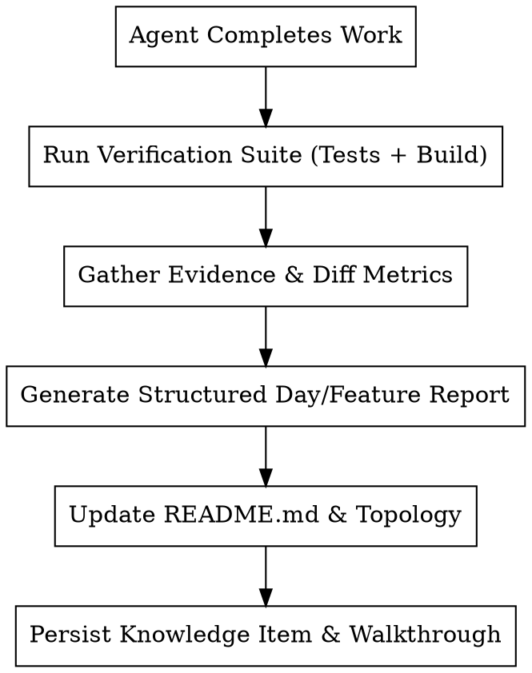

# Agent Activity Logger

## Overview

A standardized, rigorous workflow for capturing, structuring, and persisting everything an AI coding agent accomplishes during development sessions—ensuring zero knowledge loss across context windows, automated changelog generation, and immediate synchronization of project `README.md` and documentation artifacts.

---

## When to Use

### Use When

- An implementation phase, feature milestone, or debugging session is completed.
- New endpoints, frontend views, guardrails, or integrations (e.g. Sentry, RAG pipelines, LLM routing) were added.
- The user requests: *"document what you did"*, *"update readme file"*, or *"keep it in memory"*.
- Transitioning between development phases where future agents or developers need complete provenance of technical decisions, benchmarks, and test results.

### When NOT to Use

- Trivial one-line typo fixes that don't change architecture or APIs.
- Midway through broken builds before verification tests pass.

---

## Core Documentation Workflow



---

## Step-by-Step Procedure

### 1. Gather Evidence & Grounding Data

Before writing a single line of documentation, extract concrete data:

- **Git status & diffs**: `git status -s` and `git diff --stat` to identify all created and modified files.
- **Test execution logs**: Exact count of passed tests (e.g. `248 passed in 24.47s`).
- **Benchmark / Performance metrics**: Concrete numbers (e.g., latency before vs after: `4.4s -> 1.6s`, tokens saved).
- **Environment & Config keys**: New environment variables, endpoints, and CLI commands.

### 2. Update / Create Milestone Report

Structure every milestone report using the standard clinical/engineering schema:

```markdown
# [Project Name] - [Milestone Title]

## 1. Executive Summary
Brief 2-3 sentence overview of what was accomplished and clinical/business impact.

## 2. Architectural Changes & Key Components
- Bullet points mapping components, new modules, and responsibilities.
- File paths with forward slashes (e.g. `backend/app/api/generate.py`).

## 3. Performance & Latency Benchmarks
- Table comparing baseline vs optimized metrics.

## 4. Safety, Guardrails & Error Tracking
- Specific error tracking configuration (e.g., Sentry DSN, profiling, PII scrubbing).
- Fail-closed guardrails, injection detection, and scope boundary rules.

## 5. Verification & Testing Evidence
- Automated test command and output summary.
- TypeScript / frontend build verification.
- Live query validation table.
```

### 3. Sync Project README

Keep `README.md` as the authoritative single source of truth:

- **Status & Badges**: Add operational badges (e.g., Sentry Observability, Hybrid RAG, 248 Tests Passing).
- **Component Topology Diagram**: Update ASCII or Mermaid diagrams to reflect new layers.
- **Feature Matrix**: Document newly available modes, UI views, and API parameters.
- **Environment Variables Table**: Add newly introduced variables with descriptions and defaults.
- **Quickstart Guide**: Ensure copy-paste runnable instructions for both backend and frontend.

### 4. Persist Long-Term Agent Memory

- Create / update the session `walkthrough.md` and knowledge item summaries so subsequent conversations retain complete context.

---

## Quick Reference Checklist

| Action | Target File(s) | Verification Requirement |
| :--- | :--- | :--- |
| **Verify Codebase** | All modified files | Run `pytest` and `npm run typecheck` |
| **Milestone Report** | `docs/DAY{N}_*.md` | Contains architecture, metrics, safety, test logs |
| **Project README** | `README.md` | Contains badges, topology, env table, quickstart |
| **Walkthrough Artifact** | `walkthrough.md` | Summarizes changes with clickable links and evidence |

---

## Common Mistakes & Anti-Patterns

- ❌ **Vague claims without numbers**: Writing *"Latency was improved significantly"* instead of *"Latency decreased from 4395ms to 1651ms (~63% speedup)"*.
- ❌ **Documenting untested code**: Writing documentation before verifying that unit tests pass.
- ❌ **Broken file links**: Using backticks inside markdown links or using Windows backslashes in links.
- ❌ **Out-of-sync README**: Updating code and docs reports while leaving `README.md` with stale instructions.
