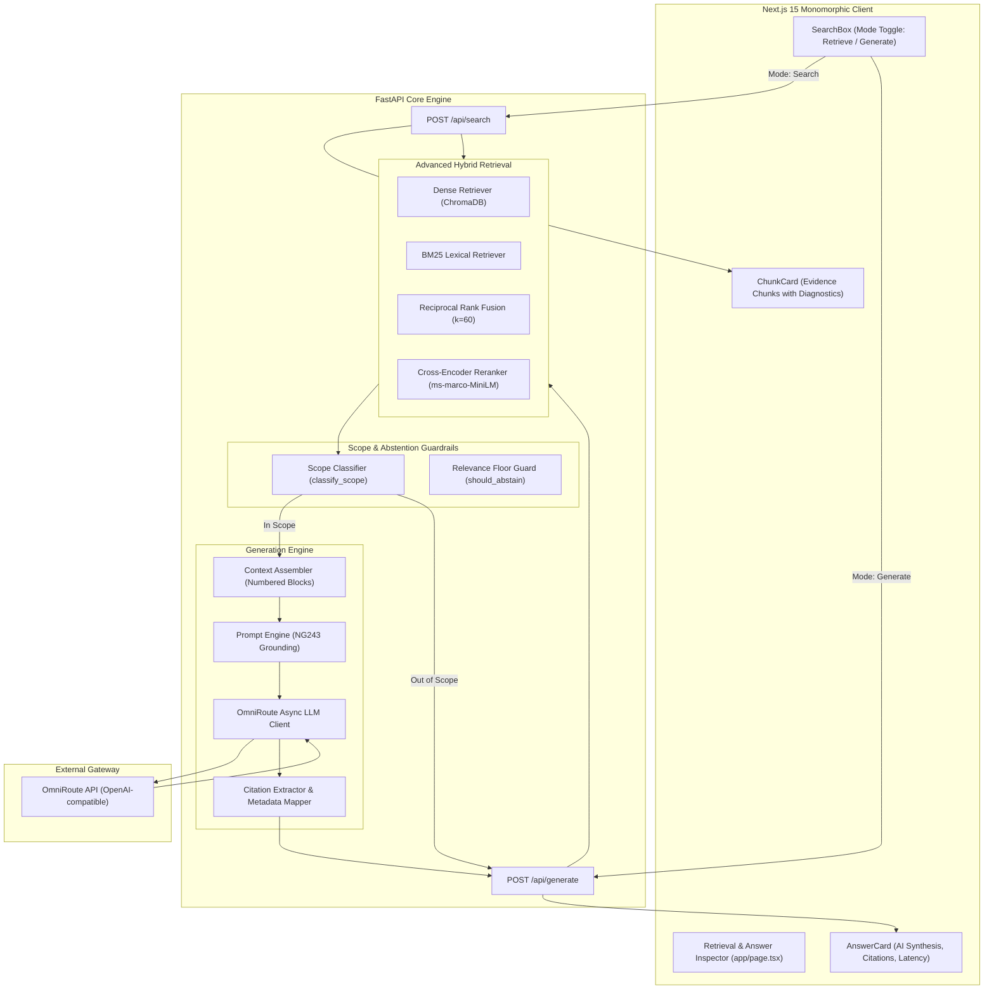

# Day 3: Evidence-Grounded Generation & System Integration

**Project:** Clinical Decision Support Lite (Eva AI)  
**Guidelines Ingested:** NICE NG243 (*Adrenal insufficiency: identification and management*)  
**Provider Gateway:** OmniRoute / OpenRouter API (`https://omniroute.dawrly.space/v1`)  
**Generation Architecture:** Evidence-Grounded RAG with Structured Inline `[Source N]` Citations, Scope Guardrails, and Dual Search/Generate UI  
**Date:** 2026-08-17  

---

> [!IMPORTANT]
> **Constitutional Grounding & Safety Rule (Principle I & V):**
> *"The model must answer ONLY based on the retrieved evidence blocks. If evidence does not clear the relevance floor or if the query falls outside scope, the system must abstain rather than hallucinate from parametric model memory."*

---

## 1. System Architecture Overview

Eva AI now features a complete end-to-end clinical decision support architecture:



---

## 2. OmniRoute LLM Client Implementation

The generation client (`backend/app/generation/client.py`) connects asynchronously to the **OmniRoute gateway** using OpenAI-compatible chat completion endpoints:

- **Endpoint:** `POST https://omniroute.dawrly.space/v1/chat/completions` (configurable via `OMNIROUTE_BASE_URL` or `OPENROUTER_BASE_URL`).
- **Authentication:** `OMNIROUTE_API_KEY` (with fallback aliases `OPENROUTER_API_KEY` and `ANTHROPIC_API_KEY`).
- **Resilience:** Built-in exponential backoff retry loop (handling status codes `429`, `500`, `502`, `503`, `504` and network timeouts up to 3 attempts).
- **Parameters:**
  - `model`: `anthropic/claude-sonnet-4.5` (or configured via `GENERATION_MODEL`)
  - `max_tokens`: `1024`
  - `temperature`: `0.1` (low temperature for deterministic, hallucination-resistant clinical outputs)

---

## 3. Evidence Assembly & Prompt Engineering

### Prompt Structure (`backend/app/generation/prompt.py`)

The prompt strictly enforces five clinical grounding constraints:

```text
SYSTEM PROMPT:
You are Eva-AI, a clinical decision support assistant specializing in 
adrenal insufficiency management. You are strictly grounded in clinical guidelines like NICE NG243.

RULES:
1. Answer ONLY based on the provided evidence blocks.
2. Cite every factual claim using [Source N] notation.
3. If the evidence does not contain enough information to answer the question, say so explicitly. Do not attempt to guess or use outside knowledge.
4. Never provide medical advice beyond what the guidelines state. 
5. Preserve exact drug names, dosages, and clinical values from the source.

When answering, structure your response logically. Use bullet points for recommendations if applicable.
At the very end of your response, always include a blank line followed by exactly this disclaimer text:
"Disclaimer: This information is for educational purposes and should not replace clinical judgment."
```

### Context Assembler (`backend/app/generation/assembler.py`)

Formats retrieved evidence into structured blocks:

```text
[Source 1]
Document: NICE NG243
Section: 1.7 Emergency management of adrenal crisis
Recommendations: 1.7.1, 1.7.2
Page: 14
---
For adults with suspected adrenal crisis, administer 100 mg hydrocortisone immediately via IV or IM injection without delaying for diagnostic confirmation...
```

---

## 4. Scope Guardrail & Abstention Flow

To prevent hallucinations on out-of-domain medical queries or queries lacking evidence, `POST /api/generate` integrates a two-stage guardrail:

1. **Stage 1: Scope Classification (`classify_scope`)**:
   - Compares the top retrieval score against `SCOPE_THRESHOLD` ($0.005$ on cross-encoder scale).
   - If the query is completely unrelated to adrenal insufficiency (e.g., *"How do I treat an acute myocardial infarction?"*), the system immediately returns an out-of-scope notification without calling the LLM.
2. **Stage 2: Relevance Floor Verification (`should_abstain`)**:
   - If all retrieved chunks score below `RELEVANCE_FLOOR` ($0.30$), the system abstains with a clear explanation advising the clinician to rephrase or broaden the search.

---

## 5. Structured Citation Extraction

The citation parser (`backend/app/generation/citations.py`):
1. Uses regular expression `r"\[Source (\d+)\]"` to detect all inline citation tags in the synthesized answer.
2. Deduplicates citations while maintaining their order of appearance.
3. Maps each numerical index (`[Source 1]`, `[Source 2]`) directly back to the original guideline chunk metadata (`document_name`, `section_title`, `section_number`, `page_number`, `source_url`).
4. Sends this structured citation list to the frontend for rendering interactive source badges.

---

## 6. Frontend UI Components

### 1. `AnswerCard.tsx`
- **Monomorphic AI Header:** AI badge with model name and latency tracker in milliseconds.
- **Evidence Status Pill:** Displays *Insufficient Evidence* banner if evidence was not found.
- **Answer Body:** Renders structured markdown and lists clinical dosages clearly.
- **Interactive Sources Cited List:** Renders cards for every cited source showing the section name and exact page link.
- **Persistent Disclaimer:** Displays clinical decision support disclaimer.

### 2. `SearchBox.tsx`
- Added interactive mode toggle between **Retrieve Evidence** and **Generate Answer**.
- Synchronized with keyboard shortcuts (`Enter`) and exemplar chips.

---

## 7. API Specification (`POST /api/generate`)

### Request
```json
POST /api/generate HTTP/1.1
Host: localhost:8010
Content-Type: application/json

{
  "query": "What dose of hydrocortisone should be given for suspected adrenal crisis in adults?",
  "top_k": 5
}
```

### In-Scope Response (200 OK)
```json
{
  "query": "What dose of hydrocortisone should be given for suspected adrenal crisis in adults?",
  "answer": "For adults with suspected adrenal crisis, administer 100 mg hydrocortisone immediately via intravenous (IV) or intramuscular (IM) injection [Source 1]. Do not delay treatment to perform diagnostic investigations.\n\nDisclaimer: This information is for educational purposes and should not replace clinical judgment.",
  "citations": [
    {
      "source_id": "1",
      "document_name": "NICE NG243",
      "section_title": "Emergency management of adrenal crisis",
      "section_number": "1.7",
      "page_number": 14,
      "source_url": "https://www.nice.org.uk/guidance/ng243"
    }
  ],
  "evidence_found": true,
  "disclaimer": "Decision-support aid for qualified clinical users. Answers are drawn only from the ingested official guidelines shown. This is not a diagnostic tool and must not be used for emergency medical decisions.",
  "model": "anthropic/claude-sonnet-4.5",
  "latency_ms": 1240
}
```

### Out-of-Scope Response (Abstention)
```json
{
  "query": "What should I do for severe chest pain from a heart attack?",
  "answer": "This question is outside the current scope of Eva AI. Eva AI currently covers adrenal insufficiency, including its identification and management, based on the registered NICE NG243 guideline.",
  "citations": [],
  "evidence_found": false,
  "disclaimer": "Decision-support aid for qualified clinical users...",
  "model": "anthropic/claude-sonnet-4.5",
  "latency_ms": 45
}
```

---

## 8. Verification & Quality Assurance

- **Unit & Integration Suite:** `151/151 passed` (`pytest backend/tests`).
- **Automated Generation Eval:** `backend/tests/eval/test_generation_quality.py` asserts correct answer generation and out-of-scope abstention over `golden_generation.yaml`.
- **Frontend Build:** `npm --prefix frontend run build` compiled with 0 errors.
