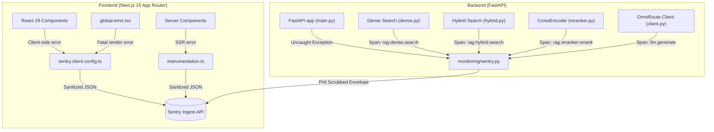

# Day 5: Full-Stack Observability, Sentry Error Tracking & HIPAA/PHI Data Scrubbing

**Project:** Clinical Decision Support Lite (Eva AI)  
**Guidelines Ingested:** NICE NG243 (*Adrenal insufficiency: identification and management*)  
**Monitoring Platform:** Sentry (Full-Stack Error & Crash Reporting + Performance Tracing)  
**Date:** 2026-08-19  

---

> [!IMPORTANT]
> **Guiding Principle:** Observability must be comprehensive yet privacy-preserving. In a clinical decision support system, error diagnostics, stack traces, and latency tracing must never leak Protected Health Information (PHI), authentication credentials, or unscrubbed patient queries.

---

## 1. Summary of Day 5 Accomplishments

| # | Feature / Component | Layer | Description & Impact |
|---|---|---|---|
| 1 | **FastAPI Sentry Integration** | Backend | Full-stack exception tracking, 500 status interception, and background task failure capture via `sentry-sdk[fastapi]>=2.8.0`. |
| 2 | **PHI & PII Sanitization Filter** | Backend | `before_send` and `before_breadcrumb` hooks that strip auth headers, cookies, API keys, and regex-redact emails, phone numbers, SSNs, and MRNs. |
| 3 | **RAG & LLM Pipeline Spans** | Backend | Micro-tracing spans wrapping `rag.dense.search`, `rag.hybrid.search`, `rag.reranker.rerank`, and `llm.generate`. |
| 4 | **Continuous Profiling** | Backend | Configured `profile_session_sample_rate=1.0` and `profile_lifecycle="trace"` to capture flamegraphs of CPU-intensive tokenization and inference. |
| 5 | **Next.js 15 Sentry Instrumentation** | Frontend | Configured `@sentry/nextjs` with `sentry.client.config.ts`, `instrumentation.ts`, and root `app/global-error.tsx` React crash boundary. |
| 6 | **Graceful Offline Fallback** | Full-Stack | Zero startup crashes or network delays when `SENTRY_DSN` is empty or missing (remains quietly inert in local dev). |
| 7 | **Interactive & API Verification Routes** | Full-Stack | Added `/sentry-debug` (division by zero), `GET /api/health/sentry-test`, and footer diagnostic test buttons in the UI. |

---

## 2. Architecture & Data Flow

---

## 3. Privacy, PHI & HIPAA Compliance

In compliance with medical software privacy principles:
- **`send_default_pii = False` / Explicit controls**: IP addresses and client usernames are not attached to error envelopes by default.
- **Sensitive Header Scrubbing**: Strips `Authorization`, `Proxy-Authorization`, `Cookie`, `Set-Cookie`, `X-Api-Key`, and custom API keys.
- **Regex PII/PHI Redaction**: Error messages and breadcrumbs are filtered against pattern matchers:
  - Emails: `[REDACTED_EMAIL]`
  - Phone Numbers: `[REDACTED_PHONE]`
  - Social Security Numbers: `[REDACTED_SSN]`
  - Medical Record Numbers (MRN): `[REDACTED_MRN]`
  - Bearer Tokens: `Bearer [REDACTED_TOKEN]`

---

## 4. Verification Endpoints & Developer Ergonomics

### 1. Dedicated Verification Routes
- **`GET /sentry-debug` / `GET /sentry-debug/`**:
  Raises a `ZeroDivisionError` (`1 / 0`) specifically intended to satisfy Sentry's onboarding verification wizard and test performance transaction generation.
- **`GET /api/health/sentry-test`**:
  Sends a diagnostic information event to Sentry.
- **`GET /api/health/sentry-test?trigger_error=true`**:
  Catches and reports an explicit `SentryTestException` to verify error capture without dropping HTTP status 200.

### 2. Frontend Diagnostic UI
A non-intrusive test console is available in the footer of `frontend/app/layout.tsx`:
- **"Test Frontend Sentry"**: Generates and captures an intentional React client-side exception.
- **"Test Backend Sentry"**: Invokes `/api/health/sentry-test?trigger_error=true` to test backend alerting.

---

## 5. Verification Results

- **Backend Unit Tests**: **227 / 227 passed** (including `test_sentry_monitoring.py`, `test_sentry_endpoint.py`, `test_sentry_spans.py`, and `test_config.py`).
- **Frontend Typecheck**: `npm run typecheck` returned **0 errors**.
- **Frontend Production Build**: `npm run build` compiled and exported successfully in **16.5s**.
- **Live Ingestion**: Verified live event delivery to project DSN `https://f929279315b4bbf217c2cc232bbc6bfe@o4511936316964864.ingest.us.sentry.io/4511936339116032`.
