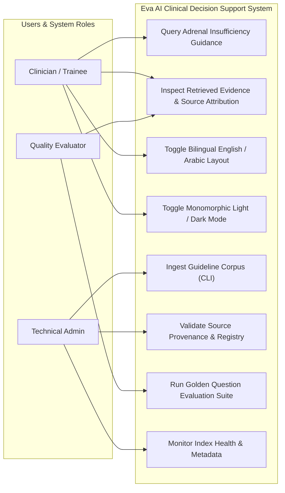
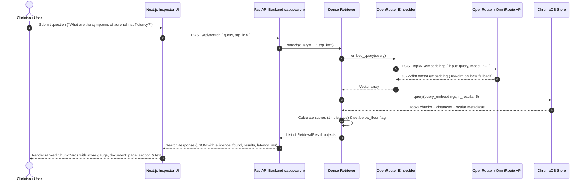
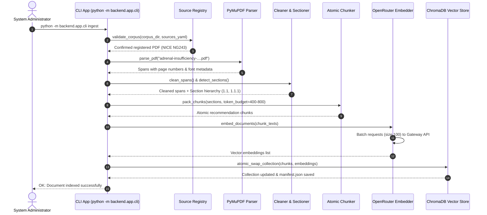
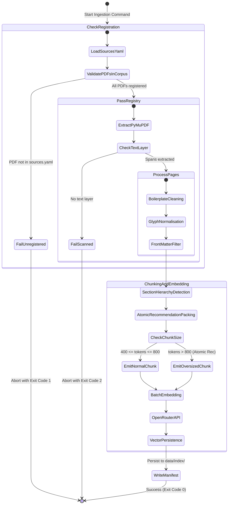
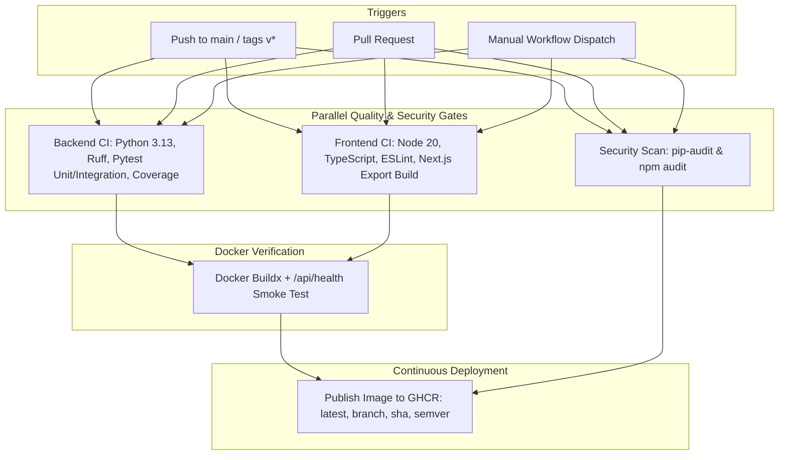

# Eva AI — Clinical Decision Support (Adrenal Insufficiency RAG)

[](https://github.com/IbrahimAbdelsattar/Eva-AI/actions/workflows/ci-cd.yml)
[](file:///c:/Users/C-LAB/Videos/ai%20hackthon/backend/tests/)
[](file:///c:/Users/C-LAB/Videos/ai%20hackthon/scripts/test_live_e2e.py)
[](file:///c:/Users/C-LAB/Videos/ai%20hackthon/docs/LOCAL_EMBEDDING_FALLBACK.md)

[](https://github.com/IbrahimAbdelsattar/Eva-AI/pkgs/container/eva-ai)
[](https://www.python.org/)
[](https://nodejs.org/)
[](https://fastapi.tiangolo.com/)
[](https://nextjs.org/)
[](https://sentry.io/)
[](https://smith.langchain.com/)
[](https://github.com/astral-sh/ruff)
[](https://www.nice.org.uk/terms-and-conditions#notice-of-rights)

---

## 📌 Executive Summary & Clinical Scope

**Eva AI (Clinical Decision Support Lite)** is an evidence-grounded Retrieval-Augmented Generation (RAG) conversational platform designed to assist **clinicians, general practitioners, and clinical trainees** in making informed clinical decisions regarding **adrenal insufficiency identification, diagnosis, emergency crisis management, and sick-day dosing rules**.

> **Scope Statement**:
> *"This system helps clinicians and clinical trainees answer questions about **adrenal insufficiency identification and management** using **NICE guideline NG243** and registered supporting official sources."*

The application pairs a high-performance **FastAPI backend** with a **Next.js 15 Monomorphic Soft UI** frontend featuring:
- 💬 **Interactive Multi-Turn RAG Chatbot**: Real-time SSE streaming answers with inline structural citations directly from NICE NG243.
- 🔁 **Multi-Turn Contextual Retrieval**: Dynamic pre-retrieval query enrichment from preceding conversation turns in `retrieve_and_scope` ensures accurate chunk retrieval on elliptical follow-up questions (e.g. *"And what about in children?"*).
- 📜 **Consultation History & Evidence Inspector**: Persistent multi-session consultation threads stored in `localStorage`, session search, markdown export, and expandable retrieved evidence accordions showing full verbatim guideline chunks, page citations, and relevance scores on every historical turn.
- 🧠 **Layered Memory & State Architecture**: Bounded client-side `localStorage` session management paired with multi-turn conversation context windows (`history[-4:]`), documented in [docs/MEMORY_ARCHITECTURE.md](file:///c:/Users/C-LAB/Videos/ai%20hackthon/docs/MEMORY_ARCHITECTURE.md).
- 🧭 **Conversational Capability Routing**: Common greetings and capability questions (for example, “How can you help me?”) return an immediate live introduction before clinical retrieval, while clinical questions retain strict evidence guardrails.
- 🔄 **Local-First Embedding Engine & Resilient Fallback**: Primary local `BAAI/bge-small-en-v1.5` embedder delivering ultra-low latency (~20–30ms) with zero remote failure risk, backed by automatic transparent failover to remote Gemini (`gemini/gemini-embedding-001`).
- 🚀 **Multi-Tier RAG Caching Architecture**: Sub-5ms response time on warm queries (**106.5x speedup**) with L1 Embedding, L2 Retrieval, and L3 Answer Caching with TTL/LRU eviction and automatic index manifest invalidation.
- 🔍 **Calibrated Thresholds**: Calibrated `RELEVANCE_FLOOR=0.68` and `SCOPE_THRESHOLD=0.68` providing 100% clean separation between authentic endocrinology queries and out-of-scope noise.
- ⚡ **Ultra-Low Latency OmniRoute Routing**: Optimized with `GENERATION_MODEL=eva-ai` (~1.6s vs 4.4s) and instant 0ms zero-LLM greeting handling.
- 🛡️ **Fail-Closed Clinical Guardrails**: Adversarial prompt injection defense, out-of-scope refusal, insufficient evidence abstention, and calibrated pre-retrieval dosage & prescription recommendation refusal with clinical scenario bypass.
- 📊 **Full-Stack Sentry & LangSmith Observability**: Distributed tracing across RAG stages, continuous CPU profiling, and automatic PHI/PII sanitization.
- 🌐 **Bilingual Medical Interface**: Native English and Arabic (RTL) support with localized terminology.


---

## 📜 Guiding Principles (System Constitution)

The core architecture enforces six strict constitutional principles:

1. **Evidence-Grounded Answers Only**: No generation or answer synthesis path exists that can bypass retrieval. Answers must be strictly grounded in verified evidence.
2. **Citation Metadata Is Structural**: Citation metadata (`document_name`, `page_number`, `section_title`, `source_url`, `chunk_id`) is stored natively on every vector entry and returned alongside relevance scores in a single query call—never in an external sidecar file.
3. **Source Legitimacy and Provenance**: Every corpus document MUST be registered in [data/sources.yaml](file:///c:/Users/C-LAB/Videos/ai%20hackthon/data/sources.yaml) with its publisher, publication year, source URL, document type, and written credibility justification. Ingestion fails closed on unregistered files.
4. **Narrow Scope Discipline**: Restricted strictly to adrenal insufficiency identification and management based on NICE NG243. Prominent decision-support disclaimers are enforced across UI and API responses.
5. **Staged Delivery**: Retrieval quality is fully verified, measured, and benchmarked before any LLM answer generation is introduced. Generation shipped only after the retrieval golden set was in place; `POST /api/generate` and `POST /api/generate/stream` are now live and evidence-gated.
6. **Human Verification Over Automated Confidence**: Weak or low-scoring evidence is never hidden or silently filtered; every retrieved chunk provides exact page-number trace-back to the original source PDF.

---

## 🏗️ System Architecture & Component Topology

The system is structured as a **monolithic repository** with strict internal modularity and protocol-driven replacement seams:

- **Development**: Two concurrent processes (`FastAPI` on `:8000` and `Next.js` on `:3000` with dev rewrites for `/api/*`).
- **Production**: Single deployable process where FastAPI serves the static frontend export (`frontend/out`).
- **Storage**: Persistent embedded **ChromaDB** vector store at [data/index/](file:///c:/Users/C-LAB/Videos/ai%20hackthon/data/index) paired with a self-describing [manifest.json](file:///c:/Users/C-LAB/Videos/ai%20hackthon/data/index/manifest.json).

### High-Level Component Topology

```mermaid
graph TD
    subgraph ClientLayer["Frontend (Next.js 15 / React 19)"]
        UI["Retrieval & Answer Inspector (app/page.tsx)"]
        SearchComp["SearchBox (Mode Toggle: Retrieve / Generate)"]
        AnswerComp["AnswerCard Component"]
        CardComp["ChunkCard Component"]
        StatusComp["IndexStatus Component"]
        SentryBtn["SentryTestButton Component"]
        LangToggle["LanguageToggle (EN / العربية)"]
        ThemeToggle["ThemeToggle (Light / Dark)"]
        SentryClient["Sentry Client SDK (sentry.client.config.ts)"]
        ApiClient["API Client (frontend/lib/api.ts)"]
    end

    subgraph ServerLayer["Backend (FastAPI Monolith)"]
        AppMain["FastAPI App Entry (backend/app/main.py)"]
        SearchApi["Search & Health API (api/search.py)"]
        GenApi["Generate API (api/generate.py)"]
        CliApp["CLI Interface (cli.py)"]
        SentryModule["Sentry Monitor & PHI Filter (monitoring/sentry.py)"]
        
        subgraph PipelineLayer["Ingestion Pipeline"]
            Reg["Source Registry (ingestion/registry.py)"]
            Parser["PyMuPDF Parser (ingestion/parser.py)"]
            Cleaner["Boilerplate Cleaner (ingestion/cleaner.py)"]
            Sectioner["Sectioner (ingestion/sectioner.py)"]
            Chunker["Atomic Recommendation Chunker (ingestion/chunker.py)"]
            Pipeline["Pipeline Orchestrator (ingestion/pipeline.py)"]
        end
        
        subgraph RetrievalEngine["Retrieval Engine"]
            DenseRetriever["Dense Cosine Retriever (retrieval/dense.py)"]
            BM25Retriever["BM25 Lexical Retriever (retrieval/bm25.py)"]
            HybridRetriever["Hybrid RRF Retriever (retrieval/hybrid.py)"]
            Reranker["Cross-Encoder Reranker (retrieval/reranker.py)"]
            ScopeGuard["Scope Classifier (retrieval/scope.py)"]
        end

        subgraph GenerationEngine["Generation Engine"]
            Assembler["Context Assembler (generation/assembler.py)"]
            PromptEng["Prompt Engine (generation/prompt.py)"]
            OmniClient["OmniRoute Async LLM Client (generation/client.py)"]
            CitationParser["Citation Extractor (generation/citations.py)"]
        end
    end


    subgraph StorageLayer["Data & Persistence"]
        Corpus["Registered PDFs (data/corpus/)"]
        SourcesYaml["Source Registry (data/sources.yaml)"]
        ChromaDB[("ChromaDB Vector Store (data/index/)")]
        Manifest["Index Manifest (data/index/manifest.json)"]
    end

    subgraph ExternalProvider["External APIs"]
        OmniRoute["OmniRoute / OpenRouter Gateway API"]
    end

    %% Client Interactions
    UI --> SearchComp
    UI --> AnswerComp
    UI --> CardComp
    UI --> StatusComp
    UI --> LangToggle
    UI --> ThemeToggle
    SearchComp --> ApiClient
    ApiClient -->|"POST /api/search"| SearchApi
    ApiClient -->|"POST /api/generate"| GenApi
    StatusComp -->|"GET /api/index"| SearchApi

    %% Server Internal Routing
    AppMain --> SearchApi
    AppMain --> GenApi
    SearchApi --> HybridRetriever
    GenApi --> HybridRetriever
    HybridRetriever --> ScopeGuard
    ScopeGuard --> Assembler
    Assembler --> PromptEng
    PromptEng --> OmniClient
    OmniClient --> OmniRoute
    OmniRoute --> OmniClient
    OmniClient --> CitationParser
    CitationParser --> GenApi
    HybridRetriever --> ChromaDB

    %% CLI and Pipeline Connections
    CliApp --> Pipeline
    CliApp --> DenseRetriever
    Pipeline --> Reg
    Pipeline --> Parser
    Pipeline --> Cleaner
    Pipeline --> Sectioner
    Pipeline --> Chunker
    Pipeline --> EmbedderProto
    Pipeline --> ChromaDB
    Pipeline --> Manifest

    %% Data Inputs
    Reg --> SourcesYaml
    Parser --> Corpus
```



---

## 🔬 RAG Ingestion Pipeline & Chunking Mechanics

The RAG pipeline translates multi-page clinical guideline PDFs into section-aware, citation-ready vector entries without losing clinical context.

### Ingestion Flow Diagram

```mermaid
graph LR
    subgraph Input["Input Data"]
        PDF["PDF File (NG243 Guideline)"]
        YAML["sources.yaml Registry"]
    end

    subgraph Stage1["1. Validation & Extraction"]
        VCheck["Fail-Closed Registry Check"]
        PyMuPDF["PyMuPDF Span Extraction (font size/weight, page #)"]
    end

    subgraph Stage2["2. Cleaning & Structure"]
        Boilerplate["Boilerplate Removal (>60% ratio)"]
        Glyph["Glyph & Hyphenation Repair"]
        FrontMatter["Front-Matter Exclusion"]
        SectionDetect["Section Hierarchy Detection (1.1 / 1.1.1)"]
    end

    subgraph Stage3["3. Atomic Chunking"]
        RecAtom["Atomic Recommendation Preservation"]
        TokenBudget["Tiktoken Budget Packing (400-800 tok)"]
        OversizedFlag["Oversized Chunk Flagging"]
    end

    subgraph Stage4["4. Embedding & Indexing"]
        OpenRouterEmbed["Batch Embedding (3072-dim Gemini)"]
        ChromaStore["ChromaDB Vector Storage (Scalar Metadata)"]
        ManifestGen["Manifest Generation (manifest.json)"]
    end

    PDF --> VCheck
    YAML --> VCheck
    VCheck --> PyMuPDF
    PyMuPDF --> Boilerplate
    Boilerplate --> Glyph
    Glyph --> FrontMatter
    FrontMatter --> SectionDetect
    SectionDetect --> RecAtom
    RecAtom --> TokenBudget
    TokenBudget --> OversizedFlag
    OversizedFlag --> OpenRouterEmbed
    OpenRouterEmbed --> ChromaStore
    ChromaStore --> ManifestGen
```



### Pipeline Key Transformations

1. **Fail-Closed Registry Validation** ([ingestion/registry.py](file:///c:/Users/C-LAB/Videos/ai%20hackthon/backend/app/ingestion/registry.py)): Verifies every PDF in `data/corpus/` against [data/sources.yaml](file:///c:/Users/C-LAB/Videos/ai%20hackthon/data/sources.yaml). Unregistered PDFs immediately abort ingestion (Exit code 1).
2. **Page-Faithful Parsing** ([ingestion/parser.py](file:///c:/Users/C-LAB/Videos/ai%20hackthon/backend/app/ingestion/parser.py)): PyMuPDF (`fitz`) extracts text spans with font size, weight, and 1-indexed source PDF page numbers.
3. **Frequency-Based Cleaning** ([ingestion/cleaner.py](file:///c:/Users/C-LAB/Videos/ai%20hackthon/backend/app/ingestion/cleaner.py)): Detects lines appearing on >60% of pages (footers, rights notices) and removes them dynamically. Repairs hyphenated word splits (`\w+-\n\w+`) and normalizes bullet glyphs (`•` $\rightarrow$ `-`). Filters non-clinical front matter (cover, contents, dot leaders).
4. **Hierarchy Detection** ([ingestion/sectioner.py](file:///c:/Users/C-LAB/Videos/ai%20hackthon/backend/app/ingestion/sectioner.py)): Identifies `N.N` major section headings (e.g., `1.2 Initial identification and referral`) and `N.N.N` numbered recommendations (e.g., `1.2.1`).
5. **Atomic Recommendation Packing** ([ingestion/chunker.py](file:///c:/Users/C-LAB/Videos/ai%20hackthon/backend/app/ingestion/chunker.py)): Numbered recommendations are **atomic**—they are never split across chunks. Consecutive sibling recommendations under the same section heading are packed into token budgets targetting 400–800 tokens (`tiktoken` `cl100k_base`). Oversized atomic recommendations are emitted whole and flagged (`is_oversized=true`).
6. **Batched Embeddings** ([embeddings/openrouter.py](file:///c:/Users/C-LAB/Videos/ai%20hackthon/backend/app/embeddings/openrouter.py)): Requests 3072-dimensional `gemini/gemini-embedding-001` vectors via OpenRouter's OpenAI-compatible endpoint with exponential backoff retries, falling back to local 384-dim `BAAI/bge-small-en-v1.5` on quota failure.
7. **Atomic Collection Swap** ([retrieval/store.py](file:///c:/Users/C-LAB/Videos/ai%20hackthon/backend/app/retrieval/store.py)): Reads/writes ChromaDB. If ingestion succeeds, the index collection is atomically swapped; if ingestion fails, existing index state is preserved.

---

## 👥 System Use Cases & User Roles



### Detailed User Stories

| Story ID | Priority | User Role | Scenario & Goal | Acceptance Criteria |
|---|---|---|---|---|
| **US1** | P1 | Technical Admin | Ingest guideline PDFs into a vector store via a single CLI command. | Non-zero chunk count; 100% metadata completeness; atomic recommendations preserved without splits. |
| **US2** | P2 | Clinician / Trainee | Search clinical questions and inspect ranked chunk cards with full provenance. | Top-K chunks returned with score, page, section, text; weak results stay visible; disclaimer displayed. |
| **US3** | P2 | Quality Evaluator | Benchmark retrieval performance against a golden question set. | Per-question HIT/MISS report; aggregate hit-rate calculated against 80% target depth. |
| **US4** | P3 | Reviewer | Verify legitimacy, licensing, and credibility of source guidelines. | [data/sources.yaml](file:///c:/Users/C-LAB/Videos/ai%20hackthon/data/sources.yaml) holds publisher, year, URL, and credibility justification for every corpus PDF. |

---

## 🔄 Interaction & Execution Flow Diagrams

### 1. Clinical Question Retrieval Flow (Sequence Diagram)



### 2. Ingestion Command Execution (Sequence Diagram)



### 3. Document Lifecycle & Validation (Activity Diagram)



---

## 🎨 Eva AI Visual System & Internationalization

The user interface implements the **Eva AI Design System**, engineered specifically for high visual comfort during clinical operations:

1. **Brand Identity Palette**:
   - **Soft Pale Ice (`#E7F0FA`)**: Primary typography highlights, light mode background elements.
   - **Steel Sky (`#7BA4D0`)**: Secondary accent glows, section indicators, active tab indicators.
   - **Royal Sapphire (`#2E5E99`)**: Primary brand actions, score gauges, top navigation highlights.
   - **Midnight Navy (`#0D2440`)**: Ground foundation and extruded card base.

2. **Monomorphic Soft-UI (Neumorphic Dark & Light Design)**:
   - Elements are visually extruded from or debossed into a continuous dark/light canvas.
   - Extruded Cards (`mono-card` & `mono-card-interactive`): Dual-shadow offset (`box-shadow: 8px 8px 22px rgba(4, 12, 23, 0.85), -6px -6px 18px rgba(46, 94, 153, 0.25)`).
   - Sunken Tracks (`mono-inset`): Sunk-in inner shadows for inputs, filter toolbars, and metadata counters.
   - Tactile Buttons (`mono-button` & `mono-button-primary`): 3D physical press states.

3. **Bilingual Internationalization (Arabic & English)**:
   - **Instant Language Switching**: Header button (`EN` / `العربية`) switches interface language dynamically.
   - **Full RTL Support**: Automates `<html dir="rtl" lang="ar">`, layout mirroring, and font switching to Google Fonts **Tajawal** & **Cairo** for natural Arabic reading.
   - **Medical Translation Dictionary** ([frontend/lib/translations.ts](file:///c:/Users/C-LAB/Videos/ai%20hackthon/frontend/lib/translations.ts)): Translates all UI components, search placeholders, filter tabs, citation labels, and quick clinical exemplars.

4. **Light & Dark Mode**:
   - Integrated `ThemeToggle` component with `localStorage` persistence.
   - Zero-flash anti-FOUC initialization script executed inside `<head>` prior to hydration.

---

## 📊 Data Model & Provenance Schemas

Entities defined in [backend/app/models.py](file:///c:/Users/C-LAB/Videos/ai%20hackthon/backend/app/models.py) enforce ChromaDB compatibility rules: **zero null values; missing strings default to `""`**.

```text
SourceDocument (1) ──< (many) Chunk
       │                        │
       │                        └──< (many) RetrievalResult   [per query, transient]
       │
       └──< referenced by GoldenQuestion.expected_doc_id

IndexManifest (1) ── describes ──> whole Chunk collection
```

### Key Schemas Summary

1. **SourceDocument** ([data/sources.yaml](file:///c:/Users/C-LAB/Videos/ai%20hackthon/data/sources.yaml)): `doc_id`, `document_name`, `filename`, `publisher`, `publication_year`, `source_url`, `document_type`, `credibility_note`, `license_note`.
2. **Chunk** ([ChromaDB Vector Store Entry](file:///c:/Users/C-LAB/Videos/ai%20hackthon/data/index)):
   - Primary ID: `chunk_id` (e.g. `nice_ng243_p09_c03`)
   - Text Content: `text`
   - Metadata: `doc_id`, `document_name`, `page_number`, `section_title`, `section_number`, `subsection_title`, `recommendation_ids`, `source_url`, `document_type`, `publication_year`, `requires_caution`, `token_count`, `is_oversized`.
3. **IndexManifest** ([data/index/manifest.json](file:///c:/Users/C-LAB/Videos/ai%20hackthon/data/index/manifest.json)): `built_at`, `embedding_model`, `embedding_dimensions`, `chunk_target_tokens`, `document_count`, `chunk_count`, `per_document` statistics.
4. **RetrievalResult**: `chunk` (Chunk schema), `score` (Cosine similarity $1 - \text{distance}$), `rank` (1-indexed), `below_floor` (boolean flag).

---

## 🚀 Operations & Quickstart Guide

### 1. Prerequisites

- **Python**: `3.13` or higher
- **Node.js**: `20.x` or `24.x`
- **OpenRouter / OmniRoute API Key**

### ⚡ One-Click Windows Launch ([start.bat](file:///c:/Users/C-LAB/Videos/ai%20hackthon/start.bat))

Run `start.bat` from the repository root. It includes **skip-if-installed** checks to ensure fast launch times:

```cmd
start.bat
```

The script automatically:
1. Creates `.venv` if missing.
2. Checks if Python dependencies (`fastapi`, `uvicorn`, `chromadb`, `pymupdf`, `tiktoken`) are installed—skips `pip install` if present!
3. Creates `.env` from `.env.example` if missing.
4. Checks if `frontend/node_modules` exists—skips `npm install` if present!
5. Launches FastAPI backend (`:8000`) and Next.js frontend (`:3000`) concurrently in separate windows.

---

### 2. Manual Commands

```bash
# 1. Activate Virtual Environment
python -m venv .venv
.venv\Scripts\activate

# 2. Install Python Dependencies
pip install -r requirements.txt

# 3. Install Frontend Dependencies
cd frontend
npm install
cd ..

# 4. Ingest Guideline Corpus
python -m backend.app.cli ingest

# 5. Start FastAPI Backend (Port 8010)
uvicorn backend.app.main:app --reload --port 8010

# 6. Start Next.js Frontend Inspector (Port 3000)
cd frontend
npm run dev
```

Open **`http://localhost:3000`** in your browser.

> **Port note.** The backend runs on **8010**, not 8000 — port 8000 is blocked by
> Windows socket permissions on this machine (`WinError 10013`). `next.config.ts`
> proxies `/api/*` to `http://127.0.0.1:8010` by default; override with the
> `BACKEND_URL` environment variable if you use a different port.

> **Do not run `npm run build` while `npm run dev` is running.** Both write to
> `frontend/.next`, and the production build leaves the dev server with a missing
> `routes-manifest.json`, which surfaces as a blanket HTTP 500. If it happens, stop the
> dev server, `rm -rf frontend/.next frontend/out`, and restart it.

---

## 💻 CLI Command Reference

The system includes a CLI interface via [backend/app/cli.py](file:///c:/Users/C-LAB/Videos/ai%20hackthon/backend/app/cli.py).

### 1. Ingest Guidelines (`ingest`)

```bash
python -m backend.app.cli ingest [--dry-run] [--doc-id DOC_ID] [--verbose]
```

- `--dry-run`: Parse, clean, and chunk without embedding or writing vectors.
- `--doc-id`: Limit ingestion to a specific registered document ID.
- `--verbose`: Output per-page parsing diagnostics.

**Exit Codes**:
| Code | Meaning |
|---|---|
| `0` | Success — Ingestion complete / Eval hit-rate $\ge 80\%$ |
| `1` | Unregistered PDF present in corpus directory |
| `2` | Scanned / No-text layer PDF |
| `3` | No sections detected in document |
| `4` | Embedding provider failure after retries |
| `5` | Configuration / Missing API key error |

### 2. Query Evidence (`query`)

```bash
# Query with hybrid search & top-k
python -m backend.app.cli query "What is the emergency management of adrenal crisis?" --top-k 5 --retriever-type hybrid --full-text
```

### 3. Golden Evaluation (`eval`)

```bash
# Run golden evaluation with Precision@3, Precision@5, and Hit Rate
python -m backend.app.cli eval [--retriever-type {dense,bm25,hybrid,hybrid_rerank}] [--top-k 5] [--matrix] [--json]
```

Runs the retrieval quality suite over the 18 golden clinical queries in [backend/tests/eval/golden_questions.yaml](file:///c:/Users/C-LAB/Videos/ai%20hackthon/backend/tests/eval/golden_questions.yaml). Target: $\ge 80\%$ hit rate, high Precision@3 and Precision@5.

> **Corpus fix (Day 7):** the sectioner previously misattributed 30 pages of unnumbered
> back matter (glossary, rationale, update history) to the last numbered section,
> flooding retrieval with noise on 61% of the index. Fixed in `sectioner.py`/`chunker.py`
> — re-ingesting now yields 34 correctly-attributed chunks, 100% golden-set hit rate, and
> hybrid Precision@3 of 0.574 (up from 0.389). See
> [DAY7_RAG_RETRIEVAL_QUALITY_AND_RERANKER_FIX.md](file:///c:/Users/C-LAB/Videos/ai%20hackthon/docs/DAY7_RAG_RETRIEVAL_QUALITY_AND_RERANKER_FIX.md).
> **Run `python -m backend.app.cli ingest` after pulling this fix** — it only takes
> effect on the next ingest, not on code deploy alone.

### 4. Comparative Benchmark Suite (`benchmark`)

```bash
# Run full automated benchmark across strategies and depths (Top-3, Top-5, Top-10)
python -m backend.app.cli benchmark --output DAY2_RETRIEVAL_OPTIMIZATION.md
```

Generates the complete Day 2 Evaluation Tracking Matrix comparing Dense Cosine, BM25 Lexical, Hybrid RRF, and Cross-Encoder Reranker. For full experimental details, see [DAY2_RETRIEVAL_OPTIMIZATION.md](file:///c:/Users/C-LAB/Videos/ai%20hackthon/DAY2_RETRIEVAL_OPTIMIZATION.md).

---

## 🌐 API Specification

### Implemented Endpoints

#### 1. `GET /api/health`
Checks server status and index readiness.

#### 2. `POST /api/search`
Retrieves top-K guideline chunks for a clinical query with relevance scores and structural metadata.

```json
{
  "query": "What are the clinical signs of primary adrenal insufficiency?",
  "top_k": 5
}
```

#### 3. `GET /api/index`
Returns index metadata (`built_at`, `embedding_model`, `chunk_count`, `document_count`).

#### 4. `GET /api/sources`
Returns all registered source documents and credibility justifications.

#### 5. `POST /api/generate`

Generates an evidence-grounded clinical answer using the OmniRoute LLM gateway with structured inline `[Source N]` citations, fail-closed scope guardrails, and conversation history support.

```json
// Request
{
  "query": "What dose of hydrocortisone should be given for suspected adrenal crisis in adults?",
  "top_k": 5,
  "history": [
    {
      "role": "user",
      "content": "What is adrenal crisis?"
    },
    {
      "role": "assistant",
      "content": "Adrenal crisis is a life-threatening medical emergency..."
    }
  ]
}

// Response (200 OK)
{
  "query": "What dose of hydrocortisone should be given for suspected adrenal crisis in adults?",
  "answer": "For adults with suspected adrenal crisis, administer 100 mg hydrocortisone immediately via IV or IM injection [Source 1]. Do not delay treatment to perform diagnostic investigations.\n\nDisclaimer: This information is for educational purposes and should not replace clinical judgment.",
  "citations": [
    {
      "source_id": "1",
      "document_name": "NICE NG243",
      "section_title": "Emergency management of adrenal crisis",
      "section_number": "1.7",
      "page_number": 14,
      "source_url": "https://www.nice.org.uk/guidance/ng243"
    }
  ],
  "evidence_found": true,
  "disclaimer": "Decision-support aid for qualified clinical users...",
  "model": "eva-ai",
  "latency_ms": 1650
}
```

#### 6. `POST /api/generate/stream`

Real-time Server-Sent Events (SSE) streaming endpoint powering the conversational chatbot UI:
- `event: meta` — Initial metadata event with model ID, scope status, and cache hit indicator.
- `event: token` — Incremental answer token deltas streamed with 0-latency perceived time.
- `event: done` — Final payload containing resolved citations, latency metrics, and disclaimers.

---

## 📊 Full-Stack Observability & Error Tracking (Sentry)

Eva AI implements enterprise-grade, privacy-preserving error tracking, performance tracing, and continuous profiling using **Sentry**.

### 1. Key Capabilities

- **FastAPI Backend Error Interception**: Automatically tracks uncaught 500 errors, background worker exceptions, and network timeouts.
- **HIPAA / GDPR PHI Data Scrubbing**: Sanitizes sensitive request headers (`Authorization`, `Cookie`, `X-Api-Key`) and regex-masks patient identifiers (emails, phone numbers, SSNs, and MRNs) before dispatch.
- **RAG & LLM Pipeline Spans**: Captures micro-tracing metrics across `rag.dense.search`, `rag.hybrid.search`, `rag.reranker.rerank`, and `llm.generate`.
- **Continuous Profiling**: Profiles CPU-intensive operations (tokenization, cross-attention inference) via `profile_session_sample_rate=1.0`.
- **Next.js 15 App Router Monitoring**: Client browser tracking (`sentry.client.config.ts`), Next.js 15 server instrumentation (`instrumentation.ts`), and fatal React render crash boundaries (`global-error.tsx`).

### 2. Environment Configuration

| Variable | Default | Description |
|---|---|---|
| `SENTRY_DSN` | `""` | Backend / SSR Sentry Project DSN. If empty, SDK stays quietly disabled. |
| `NEXT_PUBLIC_SENTRY_DSN` | `""` | Frontend Browser Sentry Project DSN. |
| `SENTRY_ENVIRONMENT` | `"development"` | Environment tag (`development`, `staging`, `production`). |
| `SENTRY_TRACES_SAMPLE_RATE` | `1.0` | Performance tracing transaction sample rate (1.0 = 100%, 0.1 = 10%). |
| `GENERATION_MODEL` | `"eva-ai"` | OmniRoute generation model identifier (~1.6s latency). |

### 3. Diagnostic & Verification Routes

- **`GET /sentry-debug` / `GET /sentry-debug/`**: Raises a controlled `ZeroDivisionError` (`1 / 0`) to immediately verify Sentry project onboarding.
- **`GET /api/health/sentry-test`**: Emits a test diagnostic message event.
- **`GET /api/health/sentry-test?trigger_error=true`**: Emits a handled `SentryTestException`.
- **UI Footer Test Buttons**: Interactive triggers in the footer of `http://localhost:3000` to test both client and server error reporting with one click.

---

## 🧪 Testing & Quality Assurance

Run the full automated test suite using `pytest`:

```bash
# Run all unit tests including Sentry monitoring, spans, endpoints, RRF, conversational history, and chunking (260 tests)
pytest backend/tests/unit/ -v

# Run Sentry-specific verification tests
pytest backend/tests/unit/test_sentry_monitoring.py backend/tests/unit/test_sentry_endpoint.py backend/tests/unit/test_sentry_spans.py -v

# Frontend TypeScript strict check and production build
cd frontend
npm run typecheck
npm run build
```


---

## 📁 Project Structure

```text
ai-hackthon/
├── README.md                                  # Full system specification & architecture guide
├── DAY2_RETRIEVAL_OPTIMIZATION.md             # Day 2 Retrieval Evaluation & Optimization Report
├── DAY3_GENERATION_AND_INTEGRATION.md         # Day 3 Evidence-Grounded Generation Specification
├── DAY4_PERFORMANCE_OPTIMIZATION.md          # Day 4 Latency & Graph RAG Optimization Report
├── DAY5_OBSERVABILITY_AND_ERROR_TRACKING.md  # Day 5 Full-Stack Sentry Observability & PHI Scrubbing
├── docs/
│   ├── ERROR_TRACKING.md                      # Sentry Integration Guide & Architecture
│   ├── FAILURES_AND_IMPROVEMENTS.md           # Systematic Failures, Root Cause & Improvements Log
│   ├── EVALUATION_METRICS_CALCULATION.md      # Mathematical Formulas & Metrics Calculation Dossier
│   ├── CLINICAL_EVALUATION_REPORT.md          # Benchmark Scorecards & Release Gate Audit
│   ├── DAY2_RETRIEVAL_OPTIMIZATION.md
│   ├── DAY3_GENERATION_AND_INTEGRATION.md
│   ├── DAY4_PERFORMANCE_OPTIMIZATION.md
│   ├── DAY5_OBSERVABILITY_AND_ERROR_TRACKING.md
│   └── DAY5_LOCAL_EMBEDDING_FALLBACK.md
├── .agents/
│   └── skills/
│       └── agent-activity-logger/             # Standardized skill for documenting agent activity & changelogs
│           └── SKILL.md
├── start.bat                                  # Fast 1-click Windows project launcher
├── requirements.txt                           # Backend Python dependencies (FastAPI, Sentence-Transformers, Sentry SDK)
├── .env.example                               # Environment configuration template
├── data/
│   ├── corpus/                                # Registered guideline PDFs (NICE NG243)
│   ├── sources.yaml                           # Provenance & credibility registry
│   └── index/                                 # Persistent ChromaDB vector store & manifest.json
├── backend/
│   ├── app/
│   │   ├── main.py                            # FastAPI app entry & /sentry-debug route
│   │   ├── config.py                          # Pydantic-settings configuration
│   │   ├── models.py                          # Pydantic data schemas (GenerateRequest, history)
│   │   ├── cli.py                             # CLI interface (ingest, query, eval, benchmark)
│   │   ├── evaluation.py                      # Retrieval metrics (Precision@3/5, Hit Rate)
│   │   ├── errors.py                          # Typed system errors & exit codes
│   │   ├── monitoring/
│   │   │   └── sentry.py                      # Sentry SDK init, PHI sanitization & trace spans
│   │   ├── api/
│   │   │   ├── search.py                      # Search, health, /sentry-test, index & sources endpoints
│   │   │   └── generate.py                    # Evidence-grounded generation & SSE streaming endpoints
│   │   ├── generation/
│   │   │   ├── client.py                      # OmniRoute / OpenRouter async LLM client with spans
│   │   │   ├── guardrails.py                  # Prompt injection detection, 0ms greeting handling, and dosage/prescription query guardrail
│   │   │   ├── prompt.py                      # NICE NG243 clinical system prompt with history
│   │   │   ├── assembler.py                   # Context evidence assembler
│   │   │   └── citations.py                   # Citation extractor & abstention logic
│   │   ├── ingestion/
│   │   │   ├── registry.py                    # Sources.yaml validator
│   │   │   ├── parser.py                      # PyMuPDF span-level PDF extractor
│   │   │   ├── cleaner.py                     # Frequency boilerplate cleaner & glyph repair
│   │   │   ├── sectioner.py                   # NICE hierarchy detector (1.1 / 1.1.1)
│   │   │   ├── chunker.py                     # Atomic recommendation chunker (Section & Fixed)
│   │   │   └── pipeline.py                    # Pipeline orchestrator with dual-index fallback
│   │   ├── retrieval/
│   │   │   ├── base.py                        # Retriever protocol seam
│   │   │   ├── dense.py                       # Cosine top-K ChromaDB retriever with spans
│   │   │   ├── bm25.py                        # BM25 lexical retriever with clinical tokenizer
│   │   │   ├── hybrid.py                      # Hybrid Dense + BM25 Reciprocal Rank Fusion with spans
│   │   │   ├── reranker.py                    # Cross-Encoder transformer reranker with spans
│   │   │   ├── factory.py                     # Retriever factory (pluggable strategies)
│   │   │   ├── scope.py                       # Clinical scope classifier & guardrail
│   │   │   └── store.py                       # ChromaDB persistent store with multi-collection support
│   │   └── embeddings/
│   │       ├── base.py                        # Embedder protocol seam
│   │       ├── fallback.py                    # Resilient FallbackEmbedder wrapper (Local BGE Primary -> Gemini Fallback)
│   │       ├── local.py                       # Local SentenceTransformer embedder (BAAI/bge-small-en-v1.5)
│   │       └── openrouter.py                  # OpenRouter batched embedding client with query cache
│   └── tests/
│       ├── unit/                              # 383 unit & integration tests (100% pass rate)
│       │   ├── test_local_embedder.py         # Local SentenceTransformer unit tests
│       │   ├── test_fallback_embedder.py      # Fallback embedder failover unit tests
│       │   ├── test_sentry_monitoring.py      # Sentry init & PHI sanitization unit tests
│       │   ├── test_sentry_endpoint.py        # /sentry-debug & /sentry-test endpoint tests
│       │   ├── test_sentry_spans.py           # Pipeline span context manager tests
│       │   ├── test_assembly.py               # Context assembly unit tests
│       │   ├── test_bm25.py                   # BM25 tokenizer and search unit tests
│       │   ├── test_citations.py              # Citation extraction and abstention tests
│       │   ├── test_config.py                 # Configuration settings tests
│       │   ├── test_hybrid.py                 # Hybrid RRF fusion & reranker fallback tests
│       │   ├── test_reranker.py               # Cross-Encoder sigmoid calibration tests
│       │   └── test_scope.py                  # Scope classification threshold tests
│       ├── integration/                       # Pipeline, generate API, latency & embedding fallback tests
│       └── eval/                              # Golden questions and retrieval evaluation
├── docs/                                      # Comprehensive Engineering & Clinical Reports
│   ├── CHUNKING_GRANULARITY_SWEEP.md          # Granularity sweep (34 vs 48 vs 82 chunks evaluation)
│   ├── LOCAL_EMBEDDING_FALLBACK.md            # Local-first embedding & high-availability fallback architecture
│   ├── RETRIEVAL_THRESHOLD_CALIBRATION.md     # Relevance floor & scope threshold calibration report (tau=0.68)
│   ├── MEMORY_ARCHITECTURE.md                 # Multi-turn conversational & multi-tier cache memory architecture
│   ├── GROUNDING_REFUSAL_VERIFICATION.md      # 4-layer safety guardrail & prescription refusal report
│   ├── CACHING_OPTIMIZATION.md                # Multi-tier RAG caching & benchmark evaluation (106.5x speedup)
│   └── CLINICAL_EVALUATION_REPORT.md          # 25-case clinical benchmark scorecard & evaluation audit
├── frontend/
│   ├── sentry.client.config.ts                # Client-side Sentry configuration & sanitization
│   ├── sentry.server.config.ts                # Server-side Sentry configuration
│   ├── sentry.edge.config.ts                  # Edge Sentry configuration
│   ├── instrumentation.ts                     # Next.js 15 server instrumentation hook
│   ├── app/
│   │   ├── global-error.tsx                   # React root crash error boundary
│   │   ├── layout.tsx                         # Root layout with Sentry test trigger
│   │   ├── page.tsx                           # Dual-mode RAG Chatbot & Evidence Inspector UI
│   │   └── globals.css                        # Monomorphic CSS styling & theme variables
│   ├── components/
│   │   ├── ChatView.tsx                       # Interactive multi-turn RAG Chatbot with streaming
│   │   ├── SentryTestButton.tsx               # Frontend & Backend Sentry test trigger button
│   │   ├── SearchBox.tsx                      # Query input with Search / Generate mode toggle
│   │   ├── AnswerCard.tsx                     # AI synthesized answer card with source badges
│   │   ├── ChunkCard.tsx                      # Ranked evidence card with diagnostics panel
│   │   ├── IndexStatus.tsx                    # Index status, mode badge & document counter
│   │   ├── ThemeToggle.tsx                    # Light/Dark mode switcher
│   │   └── LanguageToggle.tsx                 # Bilingual EN / العربية toggle
│   ├── lib/
│   │   ├── api.ts                             # Typed API client for FastAPI backend
│   │   └── translations.ts                    # English & Arabic medical translation dictionary
│   └── next.config.ts                         # Wrapped with withSentryConfig & dev proxy
│
└── specs/
    └── 001-clinical-rag-ingestion/            # Feature specification & architectural docs
        ├── spec.md                            # Feature Specification
        ├── plan.md                            # Implementation Plan
        ├── research.md                        # Phase 0 Research & Technical Decisions
        ├── data-model.md                      # Data Model Specification
        ├── quickstart.md                      # Quickstart & Gate Validation Guide
        ├── tasks.md                           # Project Task Tracking
        └── contracts/                         # OpenAPI and CLI contracts
```

---

## 🚀 CI/CD Pipeline & DevOps Automation

Eva AI includes a production-grade continuous integration and continuous deployment (CI/CD) system implemented with **GitHub Actions** and containerized publishing to **GitHub Container Registry (GHCR)**.

### Pipeline Topology



### Workflow Specifications

1. **`backend-ci`**:
   - Python 3.13 environment with pip dependency caching.
   - Code style and format checking via **Ruff**.
   - Unit and integration tests via **Pytest** with automated coverage XML report upload.
2. **`frontend-ci`**:
   - Node.js 20 environment with npm caching.
   - TypeScript strict type checking (`tsc --noEmit`).
   - Headless ESLint verification (`next lint`).
   - Static export production build (`NEXT_OUTPUT=export next build`) with build artifact storage.
3. **`security-audit`**:
   - Automated dependency vulnerability scanning with `pip-audit` and `npm audit`.
4. **`docker-smoke-test`**:
   - Builds the production multi-stage container using Docker Buildx and GitHub Actions cache.
   - Spins up the container and verifies health status against `http://localhost:8000/api/health`.
5. **`publish-ghcr`**:
   - Automatically builds and pushes multi-tagged container images to `ghcr.io/ibrahimabdelsattar/eva-ai` on main branch pushes or release tags (`v*`).

### Running Local Pre-flight CI Validation

Before committing code, developers can execute the exact pre-flight validation suite locally:

```bash
# Windows
scripts\validate-ci.bat

# Linux / macOS
chmod +x scripts/validate-ci.sh
./scripts/validate-ci.sh
```

---

## 🤖 Agent Customizations & Skills

Eva AI includes standardized agent skills ensuring persistent engineering memory, activity logging, and architectural synchronization across development sessions:

- **`agent-activity-logger`** ([.agents/skills/agent-activity-logger/SKILL.md](file:///c:/Users/C-LAB/Videos/ai%20hackthon/.agents/skills/agent-activity-logger/SKILL.md)): Captures test metrics, git status, performance benchmarks, and synchronizes `README.md` and `docs/DAY{N}_*.md` milestone reports upon completing features.

---

## 📄 Licensing & Clinical Disclaimer

### Source Copyright

- **NICE Guideline NG243**: *Adrenal insufficiency: identification and management* (Published 28 August 2024). © NICE 2024. Subject to the [NICE Notice of Rights](https://www.nice.org.uk/terms-and-conditions#notice-of-rights). Reproduced for non-commercial educational & research use within this clinical hackathon prototype.

### Medical & Regulatory Disclaimer

> ⚠️ **IMPORTANT NOTICE**:
> This software is a **decision-support research prototype** designed to assist healthcare professionals in retrieving guideline evidence. It is **NOT** a diagnostic service, emergency triage tool, or direct patient advisory system. All retrieved evidence must be evaluated by a qualified medical professional prior to clinical decision-making.

