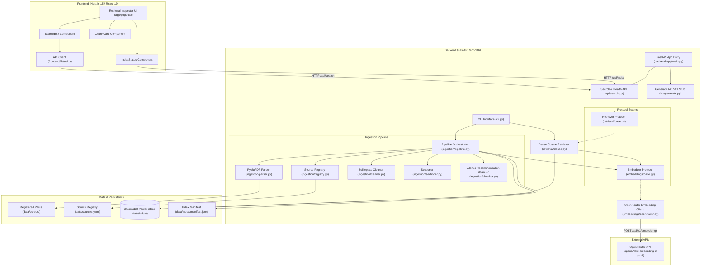
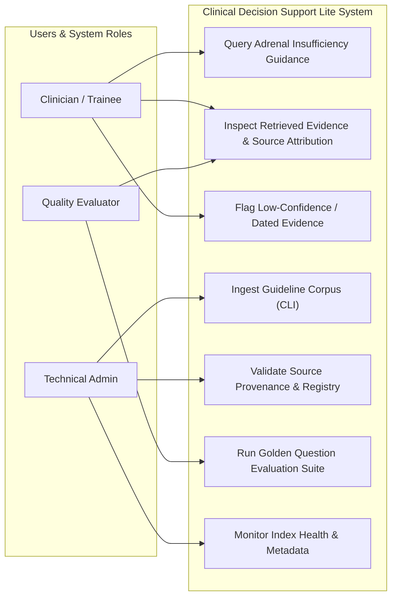
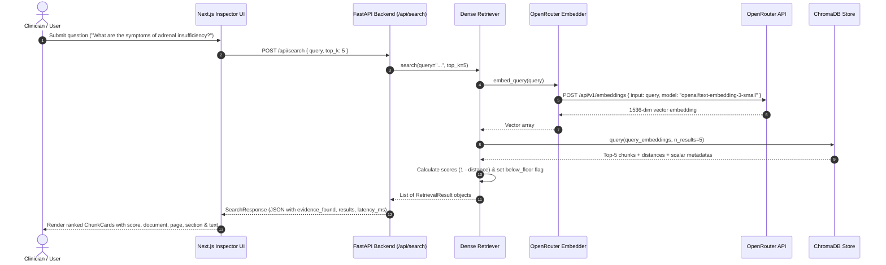
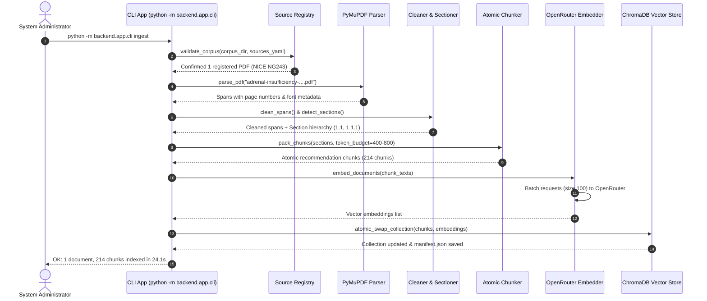
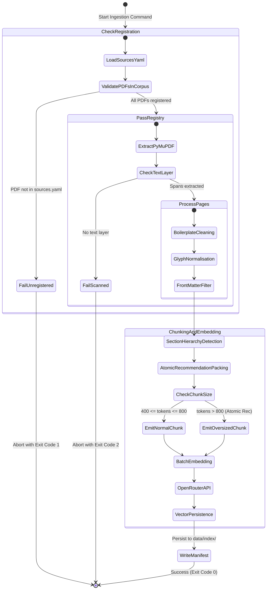

# Clinical Decision Support Lite — Adrenal Insufficiency Guideline RAG

[](https://www.python.org/)
[](https://nodejs.org/)
[](https://fastapi.tiangolo.com/)
[](https://nextjs.org/)
[](https://www.trychroma.com/)
[](https://openrouter.ai/)
[](https://www.nice.org.uk/terms-and-conditions#notice-of-rights)

---

## 📌 Executive Summary & Clinical Scope

**Clinical Decision Support Lite (CDS-Lite)** is an evidence-grounded Retrieval-Augmented Generation (RAG) system built to assist **clinicians, general practitioners, and clinical trainees** in answering complex questions regarding **adrenal insufficiency identification, diagnosis, and management**.

> **Scope Statement**:
> *"This system helps clinicians and clinical trainees answer questions about **adrenal insufficiency identification and management** using **NICE guideline NG243** and registered supporting official sources."*

The application combines a high-performance **FastAPI backend** with a **Next.js 15 Retrieval Inspector web interface**. It ingests official clinical guidelines, strips extraction noise while preserving page fidelity and section context, packs atomic clinical recommendations into token-budgeted chunks, embeds them using OpenRouter (`openai/text-embedding-3-small`), and exposes a transparent, interactive retrieval inspector.

---

## 📜 Guiding Principles (System Constitution)

The core architecture enforces six strict constitutional principles:

1. **Evidence-Grounded Answers Only**: No generation or answer synthesis path exists that can bypass retrieval. Answers must be strictly grounded in verified evidence.
2. **Citation Metadata Is Structural**: Citation metadata (`document_name`, `page_number`, `section_title`, `source_url`, `chunk_id`) is stored natively on every vector entry and returned alongside relevance scores in a single query call—never in an external sidecar file.
3. **Source Legitimacy and Provenance**: Every corpus document MUST be registered in [data/sources.yaml](file:///c:/Users/C-LAB/Videos/ai%20hackthon/data/sources.yaml) with its publisher, publication year, source URL, document type, and written credibility justification. Ingestion fails closed on unregistered files.
4. **Narrow Scope Discipline**: Restricted strictly to adrenal insufficiency identification and management based on NICE NG243. Prominent decision-support disclaimers are enforced across UI and API responses.
5. **Staged Delivery**: Retrieval quality is fully verified, measured, and benchmarked before any LLM answer generation is introduced.
6. **Human Verification Over Automated Confidence**: Weak or low-scoring evidence is never hidden or silently filtered; every retrieved chunk provides exact page-number trace-back to the original source PDF.

---

## 🏗️ System Architecture & Component Topology

The system is structured as a **monolithic repository** with strict internal modularity and protocol-driven replacement seams:

- **Development**: Two concurrent processes (`FastAPI` on `:8000` and `Next.js` on `:3000` with dev rewrites for `/api/*`).
- **Production**: Single deployable process where FastAPI serves the static frontend export (`frontend/out`).
- **Storage**: Persistent embedded **ChromaDB** vector store at [data/index/](file:///c:/Users/C-LAB/Videos/ai%20hackthon/data/index) paired with a self-describing [manifest.json](file:///c:/Users/C-LAB/Videos/ai%20hackthon/data/index/manifest.json).

### High-Level Component Topology



---

## 🔬 RAG Ingestion Pipeline & Chunking Mechanics

The RAG pipeline translates multi-page clinical guideline PDFs into section-aware, citation-ready vector entries without losing clinical context.

### Ingestion Flow Diagram

```mermaid
graph LR
    subgraph Input["Input Data"]
        PDF["PDF File (NG243 Guideline)"]
        YAML["sources.yaml Registry"]
    end

    subgraph Stage1["1. Validation & Extraction"]
        VCheck["Fail-Closed Registry Check"]
        PyMuPDF["PyMuPDF Span Extraction (font size/weight, page #)"]
    end

    subgraph Stage2["2. Cleaning & Structure"]
        Boilerplate["Boilerplate Removal (>60% ratio)"]
        Glyph["Glyph & Hyphenation Repair"]
        FrontMatter["Front-Matter Exclusion"]
        SectionDetect["Section Hierarchy Detection (1.1 / 1.1.1)"]
    end

    subgraph Stage3["3. Atomic Chunking"]
        RecAtom["Atomic Recommendation Preservation"]
        TokenBudget["Tiktoken Budget Packing (400-800 tok)"]
        OversizedFlag["Oversized Chunk Flagging"]
    end

    subgraph Stage4["4. Embedding & Indexing"]
        OpenRouterEmbed["Batch Embedding (text-embedding-3-small)"]
        ChromaStore["ChromaDB Vector Storage (Scalar Metadata)"]
        ManifestGen["Manifest Generation (manifest.json)"]
    end

    PDF --> VCheck
    YAML --> VCheck
    VCheck --> PyMuPDF
    PyMuPDF --> Boilerplate
    Boilerplate --> Glyph
    Glyph --> FrontMatter
    FrontMatter --> SectionDetect
    SectionDetect --> RecAtom
    RecAtom --> TokenBudget
    TokenBudget --> OversizedFlag
    OversizedFlag --> OpenRouterEmbed
    OpenRouterEmbed --> ChromaStore
    ChromaStore --> ManifestGen
```



### Pipeline Key Transformations

1. **Fail-Closed Registry Validation** ([ingestion/registry.py](file:///c:/Users/C-LAB/Videos/ai%20hackthon/backend/app/ingestion/registry.py)): Verifies every PDF in `data/corpus/` against [data/sources.yaml](file:///c:/Users/C-LAB/Videos/ai%20hackthon/data/sources.yaml). Unregistered PDFs immediately abort ingestion (Exit code 1).
2. **Page-Faithful Parsing** ([ingestion/parser.py](file:///c:/Users/C-LAB/Videos/ai%20hackthon/backend/app/ingestion/parser.py)): PyMuPDF (`fitz`) extracts text spans with font size, weight, and 1-indexed source PDF page numbers.
3. **Frequency-Based Cleaning** ([ingestion/cleaner.py](file:///c:/Users/C-LAB/Videos/ai%20hackthon/backend/app/ingestion/cleaner.py)): Detects lines appearing on >60% of pages (footers, rights notices) and removes them dynamically. Repairs hyphenated word splits (`\w+-\n\w+`) and normalizes bullet glyphs (`` $\rightarrow$ `-`). Filters non-clinical front matter (cover, contents, dot leaders).
4. **Hierarchy Detection** ([ingestion/sectioner.py](file:///c:/Users/C-LAB/Videos/ai%20hackthon/backend/app/ingestion/sectioner.py)): Identifies `N.N` major section headings (e.g., `1.2 Initial identification and referral`) and `N.N.N` numbered recommendations (e.g., `1.2.1`).
5. **Atomic Recommendation Packing** ([ingestion/chunker.py](file:///c:/Users/C-LAB/Videos/ai%20hackthon/backend/app/ingestion/chunker.py)): Numbered recommendations are **atomic**—they are never split across chunks. Consecutive sibling recommendations under the same section heading are packed into token budgets targetting 400–800 tokens (`tiktoken` `cl100k_base`). Oversized atomic recommendations are emitted whole and flagged (`is_oversized=true`).
6. **Batched Embeddings** ([embeddings/openrouter.py](file:///c:/Users/C-LAB/Videos/ai%20hackthon/backend/app/embeddings/openrouter.py)): Requests 1536-dimensional vector embeddings via OpenRouter's OpenAI-compatible endpoint with exponential backoff retries.
7. **Atomic Collection Swap** ([retrieval/store.py](file:///c:/Users/C-LAB/Videos/ai%20hackthon/backend/app/retrieval/store.py)): Reads/writes ChromaDB. If ingestion succeeds, the index collection is atomically swapped; if ingestion fails, existing index state is preserved.

---

## 👥 System Use Cases & User Roles



### Detailed User Stories

| Story ID | Priority | User Role | Scenario & Goal | Acceptance Criteria |
|---|---|---|---|---|
| **US1** | P1 | Technical Admin | Ingest guideline PDFs into a vector store via a single CLI command. | Non-zero chunk count; 100% metadata completeness; atomic recommendations preserved without splits. |
| **US2** | P2 | Clinician / Trainee | Search clinical questions and inspect ranked chunk cards with full provenance. | Top-K chunks returned with score, page, section, text; weak results stay visible; disclaimer displayed. |
| **US3** | P2 | Quality Evaluator | Benchmark retrieval performance against a golden question set. | Per-question HIT/MISS report; aggregate hit-rate calculated against 80% target depth. |
| **US4** | P3 | Reviewer | Verify legitimacy, licensing, and credibility of source guidelines. | [data/sources.yaml](file:///c:/Users/C-LAB/Videos/ai%20hackthon/data/sources.yaml) holds publisher, year, URL, and credibility justification for every corpus PDF. |

---

## 🔄 Interaction & Execution Flow Diagrams

### 1. Clinical Question Retrieval Flow (Sequence Diagram)



### 2. Ingestion Command Execution (Sequence Diagram)



### 3. Document Lifecycle & Validation (Activity Diagram)



---

## 📊 Data Model & Provenance Schemas

Entities defined in [backend/app/models.py](file:///c:/Users/C-LAB/Videos/ai%20hackthon/backend/app/models.py) enforce ChromaDB compatibility rules: **zero null values; missing strings default to `""`**.

```text
SourceDocument (1) ──< (many) Chunk
       │                        │
       │                        └──< (many) RetrievalResult   [per query, transient]
       │
       └──< referenced by GoldenQuestion.expected_doc_id

IndexManifest (1) ── describes ──> whole Chunk collection
```

### Key Schemas Summary

1. **SourceDocument** ([data/sources.yaml](file:///c:/Users/C-LAB/Videos/ai%20hackthon/data/sources.yaml)): `doc_id`, `document_name`, `filename`, `publisher`, `publication_year`, `source_url`, `document_type`, `credibility_note`, `license_note`.
2. **Chunk** ([ChromaDB Vector Store Entry](file:///c:/Users/C-LAB/Videos/ai%20hackthon/data/index)):
   - Primary ID: `chunk_id` (e.g. `nice_ng243_p09_c03`)
   - Text Content: `text`
   - Metadata: `doc_id`, `document_name`, `page_number`, `section_title`, `section_number`, `subsection_title`, `recommendation_ids`, `source_url`, `document_type`, `publication_year`, `requires_caution`, `token_count`, `is_oversized`.
3. **IndexManifest** ([data/index/manifest.json](file:///c:/Users/C-LAB/Videos/ai%20hackthon/data/index/manifest.json)): `built_at`, `embedding_model`, `embedding_dimensions`, `chunk_target_tokens`, `document_count`, `chunk_count`, `per_document` statistics.
4. **RetrievalResult**: `chunk` (Chunk schema), `score` (Cosine similarity $1 - \text{distance}$), `rank` (1-indexed), `below_floor` (boolean flag).

---

## 🚀 Quickstart & Setup Guide

### 1. Prerequisites

- **Python**: `3.13` or higher
- **Node.js**: `20.x` or `24.x`
- **OpenRouter API Key**: Obtainable from [OpenRouter AI](https://openrouter.ai/)

### 2. Environment Setup

Clone the repository and create the Python virtual environment:

```bash
# Activate virtual environment (Windows PowerShell)
python -m venv .venv
.venv\Scripts\activate

# Install Python dependencies
pip install -r requirements.txt

# Install Frontend dependencies
cd frontend
npm install
cd ..
```

Configure your environment variables by copying `.env.example`:

```bash
cp .env.example .env
```

Edit `.env` and fill in your `OPENROUTER_API_KEY`:

```env
OPENROUTER_API_KEY=sk-or-v1-your-openrouter-key-here
OPENROUTER_BASE_URL=https://openrouter.ai/api/v1
EMBEDDING_MODEL=openai/text-embedding-3-small
EMBEDDING_BATCH_SIZE=100
TOP_K=5
RELEVANCE_FLOOR=0.30
CORPUS_DIR=data/corpus
SOURCES_FILE=data/sources.yaml
INDEX_DIR=data/index
CHROMA_COLLECTION=guidelines
BOILERPLATE_PAGE_RATIO=0.6
```

### 3. Ingest Guideline Corpus

Perform a dry-run first to inspect parsing and chunking without calling external embedding APIs:

```bash
python -m backend.app.cli ingest --dry-run --verbose
```

Build the real vector index:

```bash
python -m backend.app.cli ingest
```

### 4. Launch Development Servers

Start the FastAPI backend server (Port `8000`):

```bash
uvicorn backend.app.main:app --reload --port 8000
```

In a second terminal, start the Next.js frontend inspector (Port `3000`):

```bash
cd frontend
npm run dev
```

Open your browser at **`http://localhost:3000`** to access the Retrieval Inspector UI.

---

## 💻 CLI Command Reference

The system includes a CLI interface via [backend/app/cli.py](file:///c:/Users/C-LAB/Videos/ai%20hackthon/backend/app/cli.py).

### 1. Ingest Guidelines (`ingest`)

```bash
python -m backend.app.cli ingest [--dry-run] [--doc-id DOC_ID] [--verbose]
```

- `--dry-run`: Parse, clean, and chunk without embedding or writing vectors.
- `--doc-id`: Limit ingestion to a specific registered document ID.
- `--verbose`: Output per-page parsing diagnostics.

**Exit Codes**: `0`: Success | `1`: Unregistered PDF | `2`: Scanned/No-text PDF | `3`: No sections found | `4`: Embedding API failure | `5`: Config error.

### 2. Query Evidence (`query`)

```bash
python -m backend.app.cli query "What is the emergency management of adrenal crisis?" --top-k 5 --full-text
```

- `--top-k`: Number of chunks to retrieve (default: 5).
- `--json`: Output raw `SearchResponse` JSON.
- `--full-text`: Print complete chunk text without truncation.

### 3. Golden Evaluation (`eval`)

```bash
python -m backend.app.cli eval [--top-k 5] [--json]
```

Runs the retrieval quality suite over the golden question set in [backend/tests/eval/golden_questions.yaml](file:///c:/Users/C-LAB/Videos/ai%20hackthon/backend/tests/eval/golden_questions.yaml).

**Exit Codes**: `0`: Hit-rate $\ge 80\%$ | `1`: Hit-rate $< 80\%$.

---

## 🌐 API Specification

### Implemented Endpoints

#### 1. `GET /api/health`
Checks server readiness and index status.

- **Response `200 OK`**:
  ```json
  {
    "status": "ok",
    "index_ready": true,
    "version": "1.0.0"
  }
  ```

#### 2. `POST /api/search`
Retrieves top-K guideline chunks for a clinical query.

- **Request Body**:
  ```json
  {
    "query": "What are the clinical signs of primary adrenal insufficiency?",
    "top_k": 5
  }
  ```
- **Response `200 OK`**:
  ```json
  {
    "query": "What are the clinical signs of primary adrenal insufficiency?",
    "evidence_found": true,
    "embedding_model": "openai/text-embedding-3-small",
    "latency_ms": 184.2,
    "disclaimer": "Decision support aid only. Not a substitute for clinical judgment.",
    "results": [
      {
        "chunk": {
          "chunk_id": "nice_ng243_p09_c01",
          "text": "1.2 Initial identification and referral...",
          "document_name": "NICE NG243 — Adrenal insufficiency: identification and management",
          "page_number": 9,
          "section_title": "1.2 Initial identification and referral",
          "section_number": "1.2",
          "subsection_title": "When to suspect adrenal insufficiency",
          "recommendation_ids": "1.2.1, 1.2.2",
          "source_url": "https://www.nice.org.uk/guidance/ng243",
          "document_type": "guideline",
          "publication_year": 2024,
          "requires_caution": false,
          "token_count": 542,
          "is_oversized": false
        },
        "score": 0.8641,
        "rank": 1,
        "below_floor": false
      }
    ]
  }
  ```

#### 3. `GET /api/index`
Returns index metadata and document/chunk counts.

#### 4. `GET /api/sources`
Returns all registered source documents and credibility justifications.

### Architected Seams (Day 2 Stubs)

#### `POST /api/generate`
- **Status**: `501 Not Implemented` (per Constitution Principle V).
- **Response `501 Not Implemented`**:
  ```json
  {
    "detail": "Answer generation is intentionally unimplemented in Day 1. Use /api/search for evidence retrieval."
  }
  ```

---

## 🧪 Testing & Quality Verification

Run the complete automated test suite using `pytest`:

```bash
# Run unit, integration, and golden evaluation tests
pytest backend/tests/ -v
```

### Golden Question Benchmark Suite

The golden question dataset in [backend/tests/eval/golden_questions.yaml](file:///c:/Users/C-LAB/Videos/ai%20hackthon/backend/tests/eval/golden_questions.yaml) tests clinical questions against expected NICE NG243 section numbers.

```bash
# Execute golden evaluation test
pytest backend/tests/eval/test_retrieval_quality.py -v
```

- **Target**: $\ge 80\%$ hit rate in top-5 results.

---

## 📁 Project Structure

```text
ai-hackthon/
├── README.md                                  # Comprehensive documentation & architecture guide
├── requirements.txt                           # Python dependencies
├── .env.example                               # Environment template
├── data/
│   ├── corpus/                                # Registered guideline PDFs (NICE NG243)
│   ├── sources.yaml                           # Provenance & credibility registry
│   └── index/                                 # Persistent ChromaDB vector store & manifest.json
├── backend/
│   ├── app/
│   │   ├── main.py                            # FastAPI app entry & static mount
│   │   ├── config.py                          # Pydantic-settings configuration
│   │   ├── models.py                          # Pydantic data schemas
│   │   ├── cli.py                             # CLI interface (ingest, query, eval)
│   │   ├── errors.py                          # Typed system errors & exit codes
│   │   ├── api/
│   │   │   ├── search.py                      # Search, health, index & sources endpoints
│   │   │   └── generate.py                    # 501 Stub for Day 2 generation
│   │   ├── ingestion/
│   │   │   ├── registry.py                    # Sources.yaml validator
│   │   │   ├── parser.py                      # PyMuPDF span-level PDF extractor
│   │   │   ├── cleaner.py                     # Frequency boilerplate cleaner & glyph repair
│   │   │   ├── sectioner.py                   # NICE hierarchy detector (1.1 / 1.1.1)
│   │   │   ├── chunker.py                     # Atomic recommendation chunker
│   │   │   └── pipeline.py                    # Pipeline orchestrator
│   │   ├── retrieval/
│   │   │   ├── base.py                        # Retriever protocol seam
│   │   │   ├── dense.py                       # Cosine top-K ChromaDB retriever
│   │   │   └── store.py                       # ChromaDB persistent store client
│   │   └── embeddings/
│   │       ├── base.py                        # Embedder protocol seam
│   │       └── openrouter.py                  # OpenRouter batched embedding client
│   └── tests/
│       ├── unit/                              # Cleaner, sectioner, chunker unit tests
│       ├── integration/                       # Pipeline & search latency integration tests
│       └── eval/
│           ├── golden_questions.yaml          # Golden clinical question dataset
│           └── test_retrieval_quality.py      # Automated retrieval hit-rate test
├── frontend/
│   ├── app/
│   │   ├── layout.tsx                         # Root layout with persistent disclaimer banner
│   │   ├── page.tsx                           # Retrieval Inspector UI page
│   │   └── globals.css                        # Modern CSS styling
│   ├── components/
│   │   ├── SearchBox.tsx                      # Query input component
│   │   ├── ChunkCard.tsx                      # Ranked evidence card with provenance
│   │   └── IndexStatus.tsx                    # Index status & document counter
│   ├── lib/
│   │   └── api.ts                             # Typed API client for FastAPI backend
│   └── next.config.ts                         # Dev rewrite proxy (/api/* -> :8000)
└── specs/
    └── 001-clinical-rag-ingestion/            # Feature specification & architectural docs
        ├── spec.md                            # Feature Specification
        ├── plan.md                            # Implementation Plan
        ├── research.md                        # Phase 0 Research & Technical Decisions
        ├── data-model.md                      # Data Model Specification
        ├── quickstart.md                      # Quickstart & Gate Validation Guide
        ├── tasks.md                           # Project Task Tracking
        └── contracts/                         # OpenAPI and CLI contracts
```

---

## 📄 Licensing & Clinical Disclaimer

### Source Copyright
- **NICE Guideline NG243**: *Adrenal insufficiency: identification and management* (Published 28 August 2024). © NICE 2024. Subject to the [NICE Notice of Rights](https://www.nice.org.uk/terms-and-conditions#notice-of-rights). Reproduced for non-commercial educational & research use within this clinical hackathon prototype.

### Medical & Regulatory Disclaimer
> ⚠️ **IMPORTANT NOTICE**:
> This software is a **decision-support research prototype** designed to assist healthcare professionals in retrieving guideline evidence. It is **NOT** a diagnostic service, emergency triage tool, or direct patient advisory system. All retrieved evidence must be evaluated by a qualified medical professional prior to clinical decision-making.
