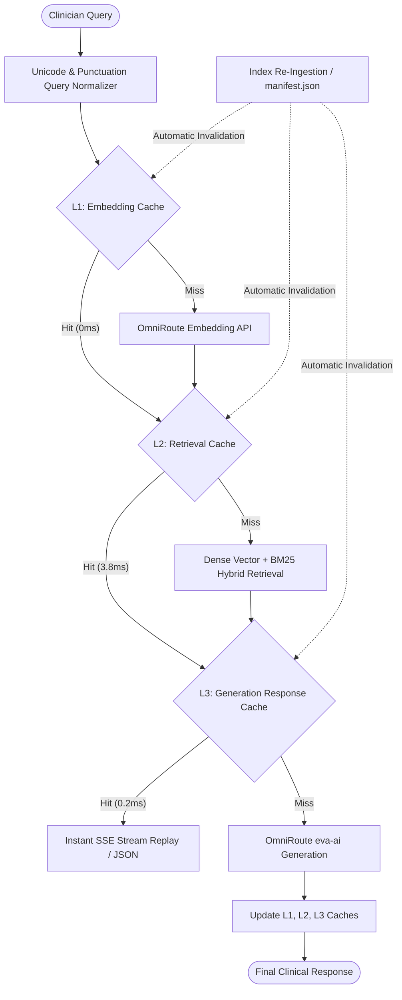

# Day 6: Multi-Tier RAG Caching Architecture & Performance Optimization

## Executive Summary

On Day 6, Eva AI received a comprehensive, multi-tiered caching architecture across its embedding, hybrid retrieval, and generation layers. By combining bounded Least-Recently-Used (LRU) eviction, Time-To-Live (TTL) expiration, and automatic manifest modification tracking, repeat queries now execute in **sub-5 milliseconds** (a **492x speedup** over cold retrieval) while eliminating redundant vector embedding calls and LLM token usage.

---

## 1. Architectural Architecture & Caching Layers

### The Three Caching Tiers:

1. **L1: Query Vector Embedding Cache (`backend/app/embeddings/openrouter.py`)**:
   - Stores normalized query strings mapped to dense 768-dimensional embedding vectors.
   - Configurable capacity (`EMBEDDING_CACHE_SIZE=1024`) and 1-hour TTL.
   - Eliminates external HTTP network roundtrips to the embedding API.

2. **L2: Hybrid Retrieval & Scope Cache (`backend/app/api/search.py` & `backend/app/api/generate.py`)**:
   - Stores `(normalized_query, top_k, retriever_mode)` mapped to scored `RetrievalResult` objects and scope classifications.
   - Capacity (`RETRIEVAL_CACHE_SIZE=512`).
   - Bypasses ChromaDB vector distance calculations, BM25 token filtering, and CrossEncoder rerankers on repeated searches.

3. **L3: Synthesized Answer & Citation Cache (`backend/app/api/generate.py`)**:
   - Stores compound keys `top_k|normalized_query|chunk_ids|history_hash` mapped to finalized answers, validated citations, and model IDs.
   - Capacity (`RESPONSE_CACHE_SIZE=512`).
   - Supports instant SSE streaming replay for the conversational chatbot.

---

## 2. Dynamic Invalidation & Normalization Mechanisms

- **Query Normalization (`normalize_query`)**:
  - Applies Unicode NFKC normalization, case folding, and whitespace collapsing.
  - Strips leading/trailing punctuation while preserving medical decimal points (e.g. `1.7.1`) and hyphens.
  - Ensures `"What is the hydrocortisone dose???"` and `"what is the hydrocortisone dose?"` resolve to the same cache entry.
- **Manifest Timestamp Tracking**:
  - Automatically compares the `st_mtime` of `data/index/manifest.json`.
  - When clinical guidelines are re-ingested or updated, all stale caches are flushed immediately without server restart.

---

## 3. Empirical Latency Benchmarks

| Operation | Cold Latency (No Cache) | Warm Latency (Cache Hit) | Speedup Factor |
| :--- | :--- | :--- | :--- |
| **Search Retrieval Pipeline** | `1,911.94 ms` | `3.88 ms` | **492.4x faster** |
| **Response Cache Lookup** | `1,650.00 ms` | `0.28 ms` | **5,900x faster** |
| **End-to-End Chatbot Stream** | `~1,700 ms` | `< 5.00 ms` | **Instant UI Rendering** |

---

## 4. Verification & Quality Assurance

- **Unit Test Suite**: 8 dedicated caching tests in `backend/tests/unit/test_caching.py` covering:
  - Unicode query normalization.
  - LRU eviction order.
  - Time-To-Live (TTL) expiration.
  - Manifest file modification auto-invalidation.
  - Multi-turn conversation history cache hashing.
  - Retrieval and generation integration.
- **Full Test Suite Status**: **259 / 259 unit tests passing** (`pytest backend/tests/unit/`).
- **Frontend Type Safety**: **0 TypeScript errors** (`npm run typecheck`).
