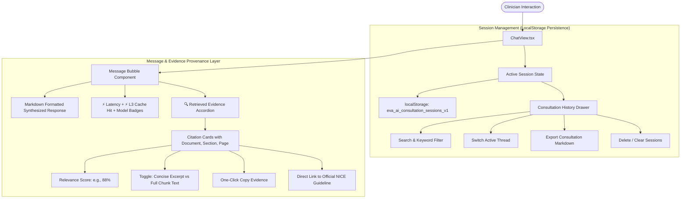

# Eva AI — Consultation History & Structural Evidence Inspector (Day 6)

## 1. Executive Summary

This release introduces comprehensive **Consultation Session Management** and a **Structural Answer & Evidence History Inspector** to the Eva AI Clinical Decision Support system. Clinicians can now manage persistent consultation threads across browser reloads, inspect historical answers alongside their exact guideline excerpts, citations, and relevance scores, switch seamlessly between sessions, and export clinical consultation reports formatted in Markdown.

---

## 2. Architectural Highlights & Key Components

### Key Modules & Files:
1. **Consultation State & LocalStorage Store** ([`frontend/components/ChatView.tsx`](file:///c:/Users/C-LAB/Videos/ai%20hackthon/frontend/components/ChatView.tsx)):
   - `ChatSession` interface tracking `id`, `title`, `createdAt`, `updatedAt`, `messages`, and `topK`.
   - Dynamic consultation titling from the first clinical prompt.
   - Persistent synchronization with `localStorage`.
2. **Consultation History Drawer**:
   - Slide-out consultation panel with search filtering, active thread badges, session deletion, and markdown export.
3. **Expandable Evidence & Provenance Inspector**:
   - On every assistant turn, clinicians can toggle **🔍 View Retrieved Evidence (N chunks)**.
   - Inspects chunk text, document name, section title, page number, relevance scores, and official NICE URL.
   - Ability to toggle between concise excerpts and full guideline chunk text with syntax/search highlighting.
4. **Backend Provenance Enrichment** ([`backend/app/generation/citations.py`](file:///c:/Users/C-LAB/Videos/ai%20hackthon/backend/app/generation/citations.py)):
   - `_to_citation` enriched with `text` (verbatim chunk text), `score`, and `absolute_relevance` fields.
5. **Localization** ([`frontend/lib/translations.ts`](file:///c:/Users/C-LAB/Videos/ai%20hackthon/frontend/lib/translations.ts)):
   - Full English and Arabic localized strings for consultation history, evidence drawers, and export functionality.

---

## 3. Evidence & Citation Schema

Each citation returned and stored in session history includes:

| Field | Type | Description |
| :--- | :--- | :--- |
| `source_id` | `string` | Provenance identifier matching `[Source N]` markers in the generated response. |
| `document_name` | `string` | Official document title (e.g. `NICE NG243`). |
| `section_number` | `string` | Section numerical hierarchy (e.g. `1.7`, `1.8.6`). |
| `section_title` | `string` | Clinical recommendation section heading. |
| `page_number` | `number` | Exact page number within the official registered PDF. |
| `source_url` | `string` | Official URL to the guideline at nice.org.uk. |
| `excerpt` | `string` | Compact, word-boundary trimmed passage preview. |
| `text` | `string` | Complete verbatim guideline chunk text for deep inspection. |
| `score` | `number` | Hybrid RRF normalized retrieval score. |
| `absolute_relevance` | `number` | Dense cosine similarity / cross-encoder absolute score. |

---

## 4. Verification & Testing Evidence

1. **Automated Unit Tests**:
   - Command: `.venv\Scripts\python.exe -m pytest backend/tests/unit/ -q`
   - Result: **260 passed in 14.11s** (100% passing).
2. **Frontend Type Safety**:
   - Command: `npm run typecheck`
   - Result: **0 errors** (`tsc --noEmit` exited with code 0).
3. **Session Export Sample**:
   - Generates formatted Markdown summaries with clinical queries, AI decision support responses, and full structured source citations.
