# Eva AI — Chunking Granularity Sweep & Corpus Sizing Evaluation (34 vs 48 vs 82 Chunks)

## 1. Executive Summary

To determine the optimal chunk size and corpus partition count for the **NICE Guideline NG243** index, we conducted a systematic empirical sweep across five chunking granularities ($N \in \{34, 48, 63, 74, 81/82\}$ chunks) evaluated against the 20-question clinical golden set using the primary local embedding model (`BAAI/bge-small-en-v1.5`, 384 dimensions).

The evaluation proves that **82 chunks is clinically unsafe** due to over-splitting failure on pediatric recommendations (`gq_19`), while **34 chunks provides 100% retrieval reliability**, and **48 chunks offers an optimal trade-off** (+11% Precision@3, +17% Precision@5).

---

## 2. Empirical Benchmark Results

All configurations were evaluated on identical hardware using dense vector search backed by `BAAI/bge-small-en-v1.5` embeddings:

| Chunks ($N$) | Target Tokens | Hit Rate | Precision@3 | Precision@5 | Mean Hit Rank | Clinical Assessment |
| :---: | :---: | :---: | :---: | :---: | :---: | :--- |
| **34** | **600** | **100%** | **0.45** | **0.36** | **1.50** | ✅ **Safe Baseline (Preserves Whole Recommendations)** |
| **48** | **250** | **100%** | **0.50** | **0.42** | **1.45** | ⭐ **Optimal (+11% P@3, +17% P@5, Lower Token Cost)** |
| **63** | **150** | **100%** | **0.47** | **0.38** | **1.40** | 🟡 Viable (Moderate Over-fragmentation) |
| **74** | **110** | **100%** | **0.48** | **0.42** | **1.55** | 🟡 Viable (Higher boundary noise) |
| **81 / 82** | **90** | **95% ❌** | **0.45** | **0.41** | **1.42** | ❌ **Failed Quality Gate (Over-split Clinical Miss)** |

---

## 3. Failure Mode Analysis: Why 82 Chunks Fails (Over-Splitting)

### 3.1 The `gq_19` Pediatric Glucocorticoid Miss
At 81–82 chunks (target size ~90 tokens), guideline text is fragmented across arbitrary sentence and paragraph boundaries.

When evaluating **`gq_19`** (*"Which glucocorticoid is recommended for routine replacement in infants, children, and young people with primary adrenal insufficiency?"*):
- **Expected Evidence**: Section `1.3` (Recommendations 1.3.1, 1.3.2 — Oral hydrocortisone replacement dosing).
- **Observed Retrieval at 82 Chunks**: Returns Section `1.9` (*Glucocorticoid withdrawal*) and Section `1.8` (*Specialist review*).
- **Root Cause**: The key contextual connection between the diagnosis (primary adrenal insufficiency), patient cohort (pediatric/children), and specific medication (hydrocortisone) was fractured across three disjoint fragments. No individual fragment maintained enough dense semantic signal to rank above broader withdrawal sections.

> ⚠️ **Clinical Consequence:**  
> In a clinical decision support system, a retrieval miss is a catastrophic failure. Because the relevant evidence never enters the LLM prompt context window, the system is forced to either **abstain** or produce an **ungrounded hallucination**.

---

## 4. Architectural Comparison: 34 vs 48 vs 82

```mermaid
graph TD
    subgraph Candidate34["34 Chunks (~600 tokens) - Production Safe"]
        A1["Whole Atomic Recommendations"] --> B1["100% Golden Set Recall"]
        B1 --> C1["Zero Context Fragmentation"]
        C1 --> D1["Larger Prompt Window (~2.5k tokens)"]
    end

    subgraph Candidate48["48 Chunks (~250 tokens) - High Precision"]
        A2["Cohesive Sub-recommendations"] --> B2["100% Golden Set Recall"]
        B2 --> C2["+11% Precision@3 / +17% Precision@5"]
        C2 --> D2["Trims Prompt Size & LLM TTFT"]
    end

    subgraph Candidate82["82 Chunks (~90 tokens) - Over-split"]
        A3["Fragmented Clauses"] --> B3["95% Hit Rate (Clinical Miss on gq_19)"]
        B3 --> C3["Misroutes Section 1.3 to 1.9/1.8"]
        C3 --> D3["Unsafe for Clinical Decision Support"]
    end
```

### 4.1 Why 34 Chunks is the Safe Production Baseline
1. **Preserves Guideline Atomic Integrity**: Ingestion strictly binds whole recommendation units (e.g. 1.7.1–1.7.4 emergency protocols) together, ensuring clinicians receive complete, self-contained guidance with verifiable page numbers.
2. **Robust Against Synonym Drift**: Larger thematic chunks contain rich medical terminology (e.g. both brand names, generic names, routes, and physiological contexts), maximizing dense similarity.

### 4.2 Why 48 Chunks is the Optimal High-Precision Target
1. **Precision Boost**: Precision@3 increases from **0.45 to 0.50** (+11%) and Precision@5 from **0.36 to 0.42** (+17%).
2. **Mean Rank Improvement**: Mean hit rank improves from **1.50 to 1.45**.
3. **Reduced Latency & Prompt Cost**: Shorter chunks reduce the total characters fed into the prompt assembler (`assemble_evidence`), reducing LLM Time-To-First-Token (TTFT) and token consumption.

---

## 5. Summary Recommendation

- **Selected Safe Operating Index**: **34 Chunks** is retained as the standard reference index for maximum recall safety and adherence to Constitution Principle I (Evidence-Grounded Answers Only).
- **Future Compression Target**: If further prompt optimization is needed, **48 chunks (~250 tokens)** is the approved candidate, retaining 100% recall while improving precision.
- **Strictly Prohibited**: Index configurations exceeding **75+ chunks** ($<100$ tokens/chunk) are forbidden to prevent semantic fragmentation and recommendation drop-out.
