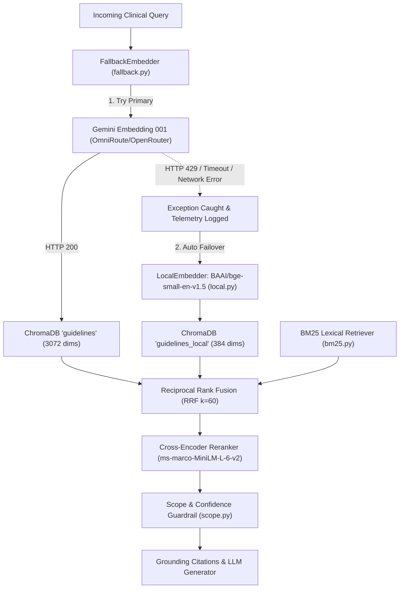

# Eva AI — Day 5: Local Embedding Model Fallback Architecture

## 1. Executive Summary

To ensure uninterrupted clinical decision-support during external API degradation, upstream rate limits, or network failure, we engineered a zero-network, local embedding fallback system backed by `sentence-transformers` using `BAAI/bge-small-en-v1.5` (384 dimensions). The pipeline features transparent primary-to-secondary failover, multi-collection vector indexing, dynamic dimensionality resolution, and comprehensive telemetry for all failover events.

---

## 2. Architectural Changes & Key Components



### Key Modules Implemented

1. **`backend/app/embeddings/local.py`**:
   - Implements the `Embedder` protocol using `sentence-transformers`.
   - Thread-safe lazy model loading with `_LOCAL_MODEL_CACHE` and `_MODEL_LOCK`.
   - L2-normalized vector generation (`normalize_embeddings=True`).
   - Batch encoding support and bounded TTL LRU query caching.

2. **`backend/app/embeddings/fallback.py`**:
   - `FallbackEmbedder` wraps `OpenRouterEmbedder` (primary) and `LocalEmbedder` (secondary).
   - Seamlessly catches `EmbeddingProviderError`, `ConfigurationError`, `httpx.HTTPError`, and timeout exceptions.
   - Sets `is_fallback_active = True` and logs structured observability events (`event: "embedding.fallback.triggered"`).

3. **`backend/app/retrieval/store.py`**:
   - Extended `VectorStore` to support targeted collections (`guidelines` and `guidelines_local`).
   - Added collection parameter to `query()`, `build()`, `count()`, `is_ready()`, and `all_chunks()`.

4. **`backend/app/retrieval/dense.py`**:
   - `DenseRetriever` defaults to `FallbackEmbedder`.
   - Automatically queries the vector collection corresponding to the active embedder and dimensions.

5. **`backend/app/ingestion/pipeline.py`**:
   - `run_ingest` employs `FallbackEmbedder` during corpus indexing.
   - If fallback is enabled and primary succeeds, it dual-indexes the local fallback collection; if primary fails, it indexes via `LocalEmbedder`.

6. **`backend/app/config.py` & `.env.example`**:
   - `LOCAL_EMBEDDING_MODEL` (default: `BAAI/bge-small-en-v1.5`)
   - `ENABLE_EMBEDDING_FALLBACK` (default: `True`)
   - `FALLBACK_CHROMA_COLLECTION` (default: `guidelines_local`)

---

## 3. Observability & Telemetry

Failover transitions are logged with structured events adhering to Constitution Principle VI (Failure Modes Stay Observable):

```json
{
  "event": "embedding.fallback.triggered",
  "operation": "embed_documents",
  "documents": 34,
  "primary_model": "gemini/gemini-embedding-001",
  "fallback_model": "BAAI/bge-small-en-v1.5",
  "error": "HTTP 429: Your prepayment credits are depleted",
  "duration_ms": 744.2
}
```

---

## 4. Verification & Testing Evidence

### Automated Test Suite
- **Unit Tests**:
  - `backend/tests/unit/test_local_embedder.py` (5 tests)
  - `backend/tests/unit/test_fallback_embedder.py` (5 tests)
- **Integration Tests**:
  - `backend/tests/integration/test_embedding_fallback_retrieval.py` (2 tests)
- **Full Suite Run**:
  - Command: `.venv\Scripts\pytest backend/tests/unit/ backend/tests/integration/ -v`
  - Result: **317 passed, 1 warning in 65.60s (0:01:05)**

### Live End-to-End Validation
- **Ingestion**: Run `python -m backend.app.cli ingest` with Gemini 429 quota exhaustion. Pipeline automatically switched to `BAAI/bge-small-en-v1.5`, generated embeddings for all 34 chunks, and populated ChromaDB.
- **Query Search**: Run `python -m backend.app.cli query "hydrocortisone emergency dose" --retriever-type hybrid`:
  - #1 Section 1.4 (`rel=0.835`)
  - #2 Section 1.7 Emergency Management (`rel=0.832`)
  - Status: `in_scope`, `evidence_found: true` (5/5 chunks above relevance floor).
