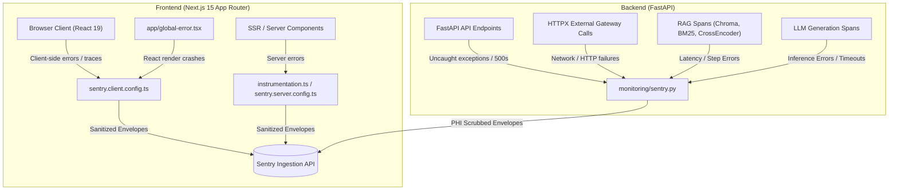

# Sentry Full-Stack Error Tracking & Performance Monitoring Guide

This document explains the full-stack error tracking, crash reporting, performance tracing, and HIPAA/GDPR-aligned data sanitization implemented across **Eva AI Clinical Decision Support** (FastAPI backend + Next.js frontend).

---

## 1. Overview & Architecture

The integration connects both the Python/FastAPI backend and the TypeScript/Next.js frontend to **Sentry**, providing:



---

## 2. Configuration & Environment Variables

All Sentry integration settings are configurable via environment variables in `.env` (referenced in `.env.example` and `backend/app/config.py`).

| Variable Name | Scope | Default | Description |
|---|---|---|---|
| `SENTRY_DSN` | Backend + Server SSR | `""` | Sentry DSN key for the Python backend. If empty, Sentry SDK remains completely inert. |
| `NEXT_PUBLIC_SENTRY_DSN` | Frontend Client | `""` | Sentry DSN key exposed to the browser client. If empty, client tracking is inert. |
| `SENTRY_ENVIRONMENT` | Full-Stack | `"development"` | Environment tag (`development`, `staging`, `production`). |
| `SENTRY_TRACES_SAMPLE_RATE` | Full-Stack | `1.0` (dev) / `0.1` (prod) | Percentage of transactions recorded for performance tracing (1.0 = 100%, 0.1 = 10%). |

---

## 3. Data Sanitization & Clinical Safety (PHI / HIPAA)

Because Eva AI processes clinical guidelines and user clinical questions, privacy protection is built directly into event submission:

1. **`send_default_pii = False`**: Prevents Sentry from capturing IP addresses, usernames, and cookies by default.
2. **Backend Event & Breadcrumb Scrubbing** (`backend/app/monitoring/sentry.py`):
   - **Header Stripping**: `Authorization`, `Proxy-Authorization`, `Cookie`, `Set-Cookie`, `X-Api-Key`, `api-key`.
   - **PHI Regex Masking**:
     - Email addresses: `[REDACTED_EMAIL]`
     - Phone numbers: `[REDACTED_PHONE]`
     - Social Security Numbers: `[REDACTED_SSN]`
     - Medical Record Numbers (MRN): `[REDACTED_MRN]`
     - Bearer tokens: `Bearer [REDACTED_TOKEN]`
     - Secret query strings: `?api_key=[REDACTED_KEY]`
3. **Frontend Client Sanitization** (`frontend/sentry.client.config.ts`):
   - Strips request cookies and headers.
   - Cleans search query parameters from captured URLs.
   - Masks personal emails and phone numbers.

---

## 4. Key Code Locations

### Backend (`FastAPI`)
- **[backend/app/monitoring/sentry.py](file:///c:/Users/C-LAB/Videos/ai%20hackthon/backend/app/monitoring/sentry.py)**: Central Sentry initialization, profiling configuration (`profile_session_sample_rate=1.0`, `profile_lifecycle="trace"`), PHI scrubbers, and `trace_span` context manager.
- **[backend/app/config.py](file:///c:/Users/C-LAB/Videos/ai%20hackthon/backend/app/config.py)**: `sentry_dsn`, `sentry_environment`, `sentry_traces_sample_rate` settings.
- **[backend/app/main.py](file:///c:/Users/C-LAB/Videos/ai%20hackthon/backend/app/main.py)**: Calls `init_sentry()` before FastAPI app creation and registers `/sentry-debug` (division by zero verification endpoint).
- **[backend/app/api/search.py](file:///c:/Users/C-LAB/Videos/ai%20hackthon/backend/app/api/search.py)**: `/api/health/sentry-test` diagnostic endpoint.

- **Pipeline Spans**:
  - `rag.dense.search` in [backend/app/retrieval/dense.py](file:///c:/Users/C-LAB/Videos/ai%20hackthon/backend/app/retrieval/dense.py)
  - `rag.hybrid.search` in [backend/app/retrieval/hybrid.py](file:///c:/Users/C-LAB/Videos/ai%20hackthon/backend/app/retrieval/hybrid.py)
  - `rag.reranker.rerank` in [backend/app/retrieval/reranker.py](file:///c:/Users/C-LAB/Videos/ai%20hackthon/backend/app/retrieval/reranker.py)
  - `llm.generate` in [backend/app/generation/client.py](file:///c:/Users/C-LAB/Videos/ai%20hackthon/backend/app/generation/client.py)

### Frontend (`Next.js 15`)
- **[frontend/sentry.client.config.ts](file:///c:/Users/C-LAB/Videos/ai%20hackthon/frontend/sentry.client.config.ts)**: Client runtime configuration with error replay sampling.
- **[frontend/sentry.server.config.ts](file:///c:/Users/C-LAB/Videos/ai%20hackthon/frontend/sentry.server.config.ts)**: Server component / SSR configuration.
- **[frontend/sentry.edge.config.ts](file:///c:/Users/C-LAB/Videos/ai%20hackthon/frontend/sentry.edge.config.ts)**: Edge runtime configuration.
- **[frontend/instrumentation.ts](file:///c:/Users/C-LAB/Videos/ai%20hackthon/frontend/instrumentation.ts)**: Next.js 15 server lifecycle instrumentation hook.
- **[frontend/app/global-error.tsx](file:///c:/Users/C-LAB/Videos/ai%20hackthon/frontend/app/global-error.tsx)**: React root crash boundary.
- **[frontend/next.config.ts](file:///c:/Users/C-LAB/Videos/ai%20hackthon/frontend/next.config.ts)**: Webpack source-mapping and build integration with `withSentryConfig`.
- **[frontend/components/SentryTestButton.tsx](file:///c:/Users/C-LAB/Videos/ai%20hackthon/frontend/components/SentryTestButton.tsx)**: Interactive diagnostic trigger component rendered in [layout.tsx](file:///c:/Users/C-LAB/Videos/ai%20hackthon/frontend/app/layout.tsx).

---

## 5. How to Test & Verify

### Automated Test Suites
Run the automated test cases to verify Sentry setup:
```bash
# Run Sentry-specific unit tests
.venv\Scripts\python.exe -m pytest backend/tests/unit/test_sentry_monitoring.py backend/tests/unit/test_sentry_endpoint.py backend/tests/unit/test_sentry_spans.py -v

# Run full backend unit test suite
.venv\Scripts\python.exe -m pytest backend/tests/unit/ -v

# Run frontend typecheck and build validation
cd frontend
npm run typecheck
npm run build
```

### Manual Testing in Browser
1. Fill in your `SENTRY_DSN` and `NEXT_PUBLIC_SENTRY_DSN` in `.env`.
2. Start the application (e.g. `./start.bat`).
3. Scroll to the footer of the web UI:
   - Click **"Test Frontend Sentry"** to trigger and report a simulated React exception.
   - Click **"Test Backend Sentry"** to call `/api/health/sentry-test?trigger_error=true` and report a simulated backend exception.
4. Verify both events appear on your Sentry Dashboard with stack traces and sanitized metadata.
