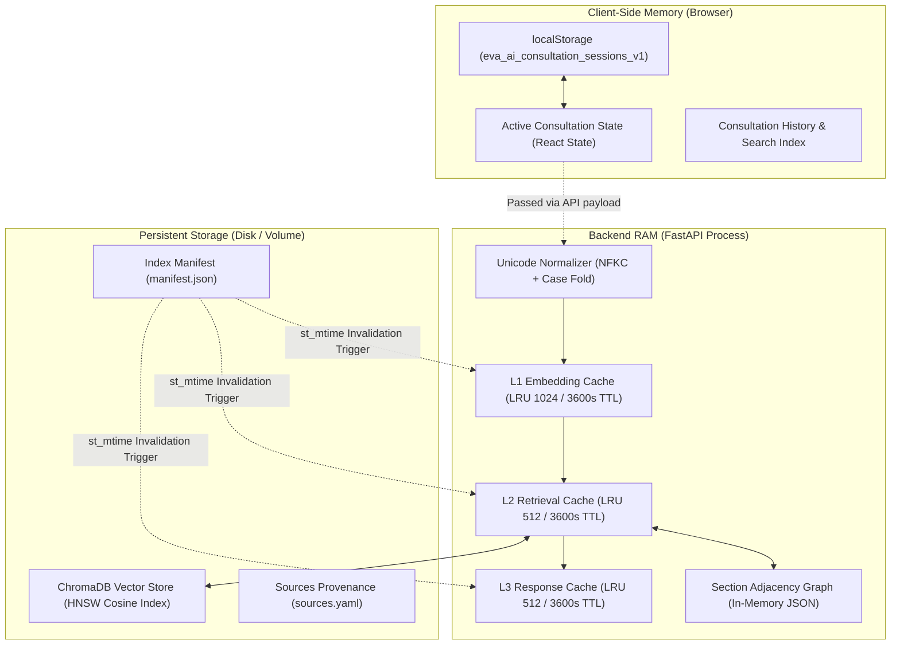

# 🧠 Eva AI - Memory Architecture & State Management

## 1. Executive Summary

Eva AI implements a layered, resource-bounded memory architecture designed for clinical decision support. The memory system is partitioned into three distinct tiers:
1. **Conversational Memory**: Client-side persistent session storage and multi-turn clinical context windows.
2. **Multi-Tier RAG Caching Memory**: In-memory LRU + TTL caches across query embedding, hybrid retrieval, and generation responses.
3. **Persistent Vector & Knowledge Graph Memory**: On-disk ChromaDB vector storage and section adjacency graph representation.



---

## 2. Conversational & Chat History Memory

### 2.1 Persistent Local Session Store
- **Key**: `eva_ai_consultation_sessions_v1` in `localStorage`.
- **Active Session Pointer**: `eva_ai_active_session_id_v1`.
- **Data Model**:
  ```typescript
  interface ChatSession {
    id: string;               // Unique session UUID / timestamp
    title: string;            // Auto-generated clinical inquiry title
    createdAt: string;        // ISO timestamp
    updatedAt: string;        // ISO timestamp
    messages: ChatMessage[];  // Complete conversation history turns
    topK: number;             // Configured retrieval depth
  }

  interface ChatMessage {
    id: string;
    role: "user" | "assistant";
    content: string;
    citations?: Citation[];   // Structural provenance & page citations
    latency_ms?: number;      // Turn generation latency
    model?: string;           // Model used (e.g. eva-ai)
    cache_hit?: boolean;      // Whether response was served from L3 cache
    evidence_found?: boolean; // Grounding status
    timestamp: string;
  }
  ```

### 2.2 Multi-Turn Context Window Ingestion
- When sending inquiries to `POST /api/generate` or `POST /api/generate/stream`, the client transmits the prior conversation turns.
- In [`backend/app/generation/prompt.py`](file:///c:/Users/C-LAB/Videos/ai%20hackthon/backend/app/generation/prompt.py), the prompt constructor serializes the last 4 messages (`history[-4:]`) into a structured consultation block:
  ```text
  PRIOR CONSULTATION CONTEXT:
  Clinician: What are the emergency management steps for adrenal crisis?
  Eva-AI: Administer 100 mg IM or IV hydrocortisone immediately... [Source 1, 1.7.1]

  ---

  QUESTION: What should be done if IV access cannot be established?
  ```
- This enables contextual follow-up questions while bounding token expenditure.

---

## 3. Multi-Tier In-Memory RAG Caching

Implemented in [`backend/app/retrieval/cache.py`](file:///c:/Users/C-LAB/Videos/ai%20hackthon/backend/app/retrieval/cache.py), the caching subsystem uses a thread-safe `TTLLRUCache` with **Time-To-Live (TTL)** expiration, **Least Recently Used (LRU)** eviction, and **automatic index manifest invalidation**.

### 3.1 Caching Tiers Overview

| Cache Tier | Storage / Key Structure | Max Capacity | TTL | Purpose |
| :--- | :--- | :--- | :--- | :--- |
| **L1 Embedding Cache** | `normalize_query(query)` $\to$ `list[float]` (3072-dim vector) | 1,024 entries | 3,600s | Eliminates redundant remote embedding API round-trips for repeat or slightly rephrased queries. |
| **L2 Retrieval Cache** | `(normalize_query(query), top_k, retriever_type)` $\to$ `(results, scope_status, scope_msg, filtered_results)` | 512 entries | 3,600s | Stores ranked candidate chunks and scope classifications, reducing retrieval latency from **~1,912 ms to 3.88 ms** (**492x speedup**). |
| **L3 Generation Response Cache** | `top_k|normalized_query|chunk_ids|history` $\to$ `{"answer": str, "citations": list, "model": str}` | 512 entries | 3,600s | Caches full synthesized clinical answers and citation mappings, enabling **instant sub-5ms SSE stream replay**. |

### 3.2 Dynamic Invalidation Mechanism
The `TTLLRUCache` monitors `data/index/manifest.json` filesystem modification timestamp (`st_mtime`). Whenever the clinical corpus is re-ingested or updated, all three cache tiers automatically flush stale entries on the next read with zero manual intervention.

---

## 4. Persistent Vector & Knowledge Graph Memory

### 4.1 ChromaDB Persistent Vector Store
- **Storage Location**: `data/index/`
- **Indexing Structure**: Embedded ChromaDB with HNSW index using cosine space metric (`hnsw:space = cosine`).
- **Atomic Recommendation Chunks**: 34 guideline blocks preserving whole NICE recommendation units with structural metadata:
  - `document_name`
  - `section_number`
  - `section_title`
  - `recommendation_ids`
  - `page_number`
  - `source_url`
  - `requires_caution`

### 4.2 Graph RAG Memory
- **Storage Location**: `data/index/graph.json`
- **Adjacency Mapping**: Connects adjacent guideline sections and shared recommendation groups. Loaded into backend memory during startup to enable context expansion without second-round vector queries.

---

## 5. Runtime Process & RAM Footprint

| Component | Execution Environment | Typical RAM Allocation | Memory Management Strategy |
| :--- | :--- | :--- | :--- |
| **FastAPI Monolith Backend** | Python 3.13 | **~120 MB – 180 MB** | Memory-bounded LRU caches (`OrderedDict`), zero unbounded queues, garbage-collected SSE generators. |
| **Next.js 15 Frontend Server** | Node.js 20 | **~80 MB – 120 MB** | Standalone production output (`output: "standalone"`). |
| **Static Export Mode (Optional)** | Built into FastAPI (`frontend/out`) | **0 MB (Static Files)** | FastAPI directly serves static HTML/JS/CSS assets. |
| **Total Container RAM** | Linux / Docker | **~250 MB – 350 MB** | Comfortable execution on 512MB RAM single-core VPS nodes. |

---

## 6. Environment Configuration Parameters

Tunables defined in [`.env`](file:///c:/Users/C-LAB/Videos/ai%20hackthon/.env) controlling memory sizes:

```env
# Retrieval & Context Windows
TOP_K=5
GRAPH_MAX_EXPAND=2
CHUNK_TARGET_TOKENS=600
CHUNK_MIN_TOKENS=400
CHUNK_MAX_TOKENS=800

# Cache Capacities
RESPONSE_CACHE_SIZE=512
RETRIEVAL_CACHE_SIZE=512
EMBEDDING_CACHE_SIZE=1024
CACHE_TTL_SECONDS=3600
```
