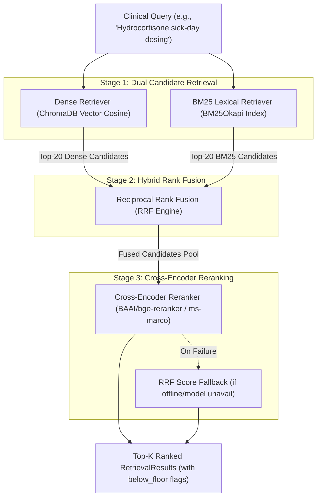

# Design Specification: Hybrid Search (BM25 + Dense) & Cross-Encoder Reranking

**Author**: Antigravity & User  
**Date**: 2026-08-17  
**Status**: Approved  

---

## 1. Overview & Problem Statement

Currently, **Eva AI** relies exclusively on **Dense Cosine Vector Retrieval** over ChromaDB (`openai/text-embedding-3-small` / OpenRouter embeddings). While dense embeddings capture semantic meaning effectively, clinical decision-support systems require high precision for exact medical keywords, drug names (e.g., *Hydrocortisone*, *Fludrocortisone*, *Dexamethasone*), specific lab values, and numerical dosage rules (e.g., *100 mg*, *20 mg/day*).

### Goal
Implement **Hybrid Search** (combining **BM25 lexical search** and **Dense vector search** via **Reciprocal Rank Fusion - RRF**) paired with a **Cross-Encoder Reranker** (`sentence-transformers` / `FlashRank` cross-attention model) to re-score top candidate evidence chunks. This architecture drastically reduces hallucinations and improves retrieval accuracy for sensitive clinical queries while maintaining strict adherence to system constitutional principles.

---

## 2. Constitutional Principles & Constraints

1. **Evidence-Grounded Answers Only** (Principle I): All retrieval paths must output verified clinical chunks with exact provenance.
2. **Structural Citation Trail** (Principle II): Citation metadata (`document_name`, `page_number`, `section_title`, `recommendation_ids`) is preserved across all retrieval and reranking stages.
3. **Observable Failure Modes** (Principle VI): Weak matches must **never** be silently dropped or hidden. Results below `relevance_floor` (0.30) are returned with `below_floor=True`.
4. **Graceful Fallback**: If cross-encoder model weights cannot be loaded or initialized, the system gracefully falls back to Reciprocal Rank Fusion (RRF) hybrid scoring without breaking API endpoints or failing search queries.

---

## 3. Component Architecture & Topology

---

## 4. Detailed Component Design

### 4.1 BM25 Lexical Retriever (`backend/app/retrieval/bm25.py`)
- **Tokenizer**: Custom clinical text tokenizer that preserves medical terms, hyphenated drug names, recommendation IDs (e.g., `1.2.1`), and numbers.
- **Index Lifecycle**: Built in-memory from `VectorStore.all_chunks()` when `BM25Retriever` initializes or when the collection is re-indexed via CLI ingestion.
- **Scoring**: Computes BM25Okapi scores normalized to $[0, 1]$ interval.

### 4.2 Reciprocal Rank Fusion (RRF)
Combines candidate rankings from Dense and BM25 search using standard RRF formula:
$$RRF\_Score(d) = \frac{w_{dense}}{k + rank_{dense}(d)} + \frac{w_{bm25}}{k + rank_{bm25}(d)}$$
where $k = 60$, $w_{dense} = 1.0$, $w_{bm25} = 1.0$.

### 4.3 Cross-Encoder Reranker (`backend/app/retrieval/reranker.py`)
- **Model**: Cross-Encoder architecture (`sentence-transformers/ms-marco-MiniLM-L-6-v2` or `BAAI/bge-reranker-base` / `flashrank`).
- **Input**: Query-Chunk text pairs `(query, chunk.text)`.
- **Output**: Calibrated relevance score per chunk in $[0, 1]$.
- **Fallback**: Catches initialization or runtime errors and returns RRF scores seamlessly.

### 4.4 Retriever Protocol & Factory (`backend/app/retrieval/factory.py`)
- Config setting `RETRIEVER_TYPE` (`"dense"`, `"hybrid"`, `"hybrid_rerank"`, default `"hybrid_rerank"`).
- `get_retriever(settings)` returns the configured implementation satisfying `Retriever` protocol (`backend/app/retrieval/base.py`).

---

## 5. Implementation Plan Summary

1. Add dependencies to `requirements.txt` (`rank-bm25`, `sentence-transformers`, `torch` or ONNX `flashrank`).
2. Add settings to `backend/app/config.py` (`retriever_type`, `reranker_model`, `hybrid_candidate_k`).
3. Implement `BM25Retriever` in `backend/app/retrieval/bm25.py`.
4. Implement `CrossEncoderReranker` in `backend/app/retrieval/reranker.py`.
5. Implement `HybridRetriever` in `backend/app/retrieval/hybrid.py`.
6. Implement `get_retriever()` factory in `backend/app/retrieval/factory.py`.
7. Wire factory into `backend/app/api/search.py` and `backend/app/cli.py`.
8. Write comprehensive unit and integration tests under `backend/tests/unit/` and `backend/tests/eval/`.

---

## 6. Verification & Quality Gates

- **Unit Tests**: Test BM25 tokenization, score normalization, RRF rank fusion logic, and CrossEncoder fallback behavior.
- **Integration Tests**: Verify end-to-end `/api/search` endpoint returns ranked results with valid latencies and structural citations.
- **Evaluation Suite**: Run `python -m backend.app.cli eval` to benchmark retrieval hit-rate against `golden_questions.yaml` (Target: $\ge 80\%$ hit rate).
